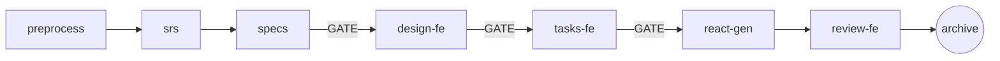

# Pipeline Guide — React/Zalo Mini App

## 🗺️ Tổng quan

Hệ thống pipeline giúp AI tự động hóa quy trình phát triển phần mềm React/Zalo Mini App từ phân tích yêu cầu đến sinh code, thông qua chuỗi skill được sắp xếp theo thứ tự.

## 🚀 Quick Start

```
1. /calibrate-knowledge --react --map                       -> map-structures → END
2. /calibrate-knowledge --react --scan                      -> SCAN React conventions
3. /calibrate-knowledge --react --learn                     -> LEARN React patterns (1 conversation đủ)
4. /feature-pipeline <name>                                 -> Full feature pipeline
5. /cr-pipeline <name>                                      -> Change request pipeline
```

## 📋 Pipeline Catalog

### Calibration (Hiệu chỉnh tri thức)

| Pipeline | File | Mô tả |
|----------|------|-------|
| **Router** | `calibrate-knowledge.md` | Route tới calibrate-react |
| **React** | `calibrate-react.md` | SCAN + LEARN React (1 conversation) |

### React Learn Sub-Skills (8 total):
| Sub-Skill | Output |
|-----------|--------|
| learn-react-architecture | knowledge_react_architecture.md |
| learn-react-component | knowledge_react_component.md |
| learn-react-state-service | knowledge_react_state_service.md |
| learn-react-shared-component | knowledge_react_shared_component.md |
| learn-react-hook-helper | knowledge_react_hook_helper.md |
| learn-react-util | knowledge_react_util.md |
| learn-zmp-sdk | knowledge_zmp_sdk.md |
| learn-error-debug | knowledge_error_debug.md |

### Feature Development



### Feature Pipeline — Steps

| Nhóm | Step | Skill | Mô tả | Output | GATE? |
|------|------|-------|--------|--------|:-----:|
| **Phân tích** | `preprocess` | Thu thập + phân tích URD/Confluence | `pre_process.md` | |
| **Phân tích** | `srs` | Sinh SRS từ pre_process | `srs.md` | |
| **Phân tích** | `specs` | Sinh behavioral specs | `specs/**/*.md` | ✅ |
| **Frontend** | `design-fe` | Thiết kế UI Component, React Route, Jotai State | `design-fe.md` | ✅ |
| **Frontend** | `tasks-fe` | Tạo danh sách tasks React theo UI layer | `tasks-fe.md` | ✅ |
| **Frontend** | `react-gen` | Sinh code React (TSX / TS) | `.tsx`, `.ts` files | |
| **Frontend** | `review-fe` | Kiểm tra source code React UI đã sinh | `todo-uncover-fe.md` | |
| **Đóng gói** | `archive` | Sync docs + archive change | archived dir | |

### CR Pipeline — Change Request

Tương tự Feature nhưng bắt đầu với `cr-analyze` thay `preprocess`:
1. `cr-analyze` → scan existing code → generate current-code-logic + compare-logic + proposal
2. Continue from `srs` → `specs` → `design-fe` → ...

## 🔧 Cách dùng

### Tạo Feature mới
```
/feature-pipeline product-listing
```
AI sẽ chạy tuần tự: preprocess → srs → specs → [GATE] → design-fe → [GATE] → tasks-fe → [GATE] → react-gen → review-fe → archive

### Thay đổi Feature (CR)
```
/cr-pipeline update-product-search
```
AI scan code hiện tại trước → so sánh → propose → continue pipeline

### Calibrate Knowledge
```
/calibrate-knowledge --react --scan    # Scan source code vs convention rules
/calibrate-knowledge --react --learn   # Generate/update knowledge files
/calibrate-knowledge --react --map     # Generate system_overview.md
```

## 🔐 Artifact Context — Why separate design-fe?

### Tại sao tách design-fe riêng?

| Artifact | Loads | Lý do |
|----------|-------|-------|
| `design-fe`, `tasks-fe` | Load **chỉ** `React Rule`, kiến trúc Component, Hooks, Jotai. | Giúp AI tập trung vào UI, không hallucinate ra mô hình Database vào trang Frontend. Thất bại (HALT) nếu thiếu Rule React. |
| `apply` | Load full knowledge + rules. | Cần toàn bộ context để sinh code chính xác. |

### FAQs

**Q: Tại sao AI bị HALT "Missing required rule"?**

**A:** Dự án thiếu các văn bản quy định (vd: `PRJ-07-react-scan-rule.md`). Hãy dùng `/calibrate-knowledge --react --scan` để sinh rule trước.

**Q: Pipeline bị dừng giữa chừng?**

**A:** Pipeline hỗ trợ Smart Resume. Chạy lại cùng lệnh — AI sẽ detect artifacts đã tồn tại và nhảy tới step tiếp theo.

## 📁 Available Commands

```
/calibrate-knowledge --react --scan|--learn|--map
/feature-pipeline <name>
/cr-pipeline <name>
```
