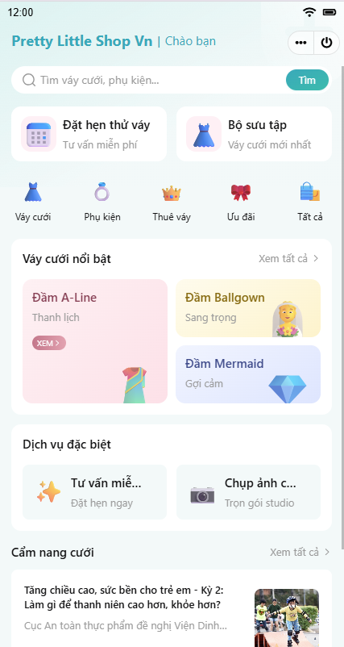
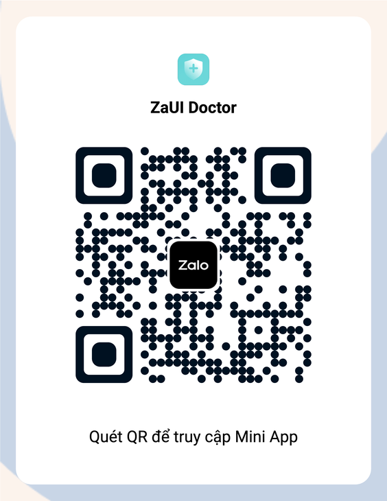

# Pretty Little Shop Vn

<p style="display: flex; flex-wrap: wrap; gap: 4px">
  
  
  
  
  
  
</p>

A React-based Zalo Mini App designed specifically for a premium Wedding Dress Shop. This app allows customers to browse featured dresses, book fitting appointments, and chat with styling consultants.

|                    Demo                     |                  Entrypoint                  |
| :-----------------------------------------: | :------------------------------------------: |
|  |  |

## Features

- **Booking Workflow**: 3-step form to book wedding dress fitting appointments (select dress style, consultant, and input body measurements).
- **Consulting**: Ask a question or request styling advice with multi-image upload.
- **Showcase**: List of featured dresses, promotions, and wedding blog posts.
- **Management**: Appointment and schedule tracking.
- **Support**: Direct chat integration with Zalo OA.
- **Profile**: Customer profile page.

## Setup

### Using Zalo Mini App Extension

1. Install [Visual Studio Code](https://code.visualstudio.com/download) and [Zalo Mini App Extension](https://mini.zalo.me/docs/dev-tools).
2. Click on **Create Project** > Choose **ZaUI Doctor** template (or clone this custom source).
3. **Configure App ID** and **Install Dependencies**, then navigate to the **Run** panel > **Start** to develop your Mini App 🚀

### Using Zalo Mini App CLI

> **Note:** Vite 5 compatibility in CLI is under development. Until then, please use the Zalo Mini App Extension.

1. [Install Node JS](https://nodejs.org/en/download/).
2. [Install Zalo Mini App CLI](https://mini.zalo.me/docs/dev-tools/cli/intro/).
3. **Download** or **clone** this repository.
4. **Install dependencies**:
   ```bash
   npm install
   ```
5. **Start** the dev server using `zmp-cli`:
   ```bash
   zmp start
   ```
6. **Open** `localhost:3000` in your browser and start coding 🔥

### Using Zalo Mini App Studio

This template is built using **Vite 5.x**, which is **not compatible** with Zalo Mini App Studio.

## Deployment

1. **Create** a Zalo Mini App ID. For instructions, please refer to the [Coffee Shop Tutorial](https://mini.zalo.me/tutorial/coffee-shop/step-1/).

2. **Deploy** your mini program to Zalo using the ID created.

   If you're using Zalo Mini App Extension: navigate to the Deploy panel > Login > Deploy.

   If you're using `zmp-cli`:

   ```bash
   zmp login
   zmp deploy
   ```

3. Scan the **QR code** using Zalo to preview your mini program.

## Usage

The repository contains sample UI components and features for building your wedding shop application. You may modify the code to suit your specific boutique needs.

Here are some recipes and instructions on how to customize the application.

### Register a new page

To register a new page:

1. Create a new folder in `src/pages/`.
2. Create an `index.tsx` file containing a `*Page` component.
3. Register the page in `src/router.tsx`:

   ```tsx
   {
      path: "/payment-result",
      element: <PaymentResultPage />,
      handle: {
         back: true, // If the page has a back button
         title: "Giao dịch hoàn tất", // The title to be shown on the header
      },
   }
   ```

4. Sections of a page can be split into components in the same folder. For example: `src/pages/payment-result/tab1.tsx`, `src/pages/payment-result/tab2.tsx`,...

### Load data from your server

Data are loaded into view using Jotai's state, called [atoms](https://jotai.org/docs/core/atom). You can change how data are loaded without changing the UI by replacing `src/state.ts`:

```diff
- export const consultantsState = atom<Promise<Consultant[]>>(mockConsultants);
+ export const consultantsState = atom<Promise<Consultant[]>>(async () => {
+   const response = await fetch("https://");
+   return response.json();
+ });
```

As long as the new data satisfies the given TypeScript interface (for example, `Consultant`), no changes to the UI are required. Otherwise, feel free to refactor the interfaces and the UI to suit your DTO.

### Handle form submission

Modify the `onSubmit` logic in the form you want to handle submission. For example:

```diff tsx filename="src/pages/booking/step2.tsx"
onSubmit={async () => {
-   // Custom Processing
+   const response = await fetch("https://", {
+      method: "POST",
+      headers: {
+      "Content-Type": "application/json",
+      },
+      body: JSON.stringify(formData),
+   });
   navigate("/booking/3", {
      viewTransition: true,
   });
}}
```

### Change header title

Modify `app-config.json` > `app.title` field.

```json
{
   "app": {
      "title": "Pretty Little Shop Vn",
```

### Change OA ID

There is a CTA block to chat with Zalo OA. To change the Zalo OA for chat, modify `app-config.json` > `template.oaID` field:

```json
{
   "template": {
      "name": "pretty-little-shop-vn",
      "oaID": "4318657068771012646"
```

### Customization

This app uses a premium rose/pink theme tailored for a wedding boutique. It can be customized further by changing the main colors in `src/css/app.scss`:

```css
:root {
  --primary: #c2185b;
  --primary-gradient: #e91e63;
  --background: #fdf2f8;
  --disabled: #9a9a9a;
}
```
