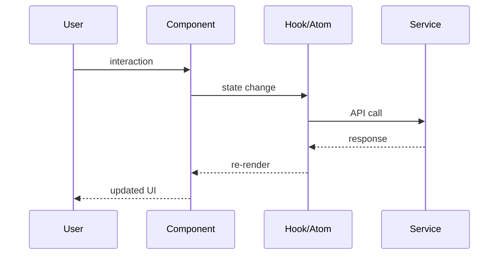

# Feature Planning Rules

Tech Stack: React 18 / TypeScript / Vite / Jotai / ZMP SDK / ZMP UI / Tailwind CSS 3

---

## §1 Planning Rules (Management & Structure)

### §1.1 File Structure & Changes
- new file: list name, full path, purpose
- edit: list file, function/component to update, expected changes summary
- structural change (folder move): provide specific reason

### §1.2 Business Logic Mapping
1-1 mapping between logic design and URD/spec document:

| Logic/Function | Behavior | Ref (ID/Section) | Constraint |
|:---|:---|:---|:---|
| `useAuth()` | check user auth via ZMP SDK | Section 3.1 | ZMP SDK required |

### §1.3 Config & Error Management
- new configs: list key + default_value + effect + env_usage (`import.meta.env` or `app-config.json`)
- new error messages: list message + trigger_context + UI behavior
- new routes: list path + component + guard (if any)

### §1.4 Impact Analysis
- backward_compat: will this break existing routes || components?
- dependencies: which shared components || hooks || atoms affected?
- risks: ZMP SDK compatibility, mobile performance, Zalo platform restrictions?

### §1.5 Maintainability
- design for long-term maintainability
- new files MUST follow folder convention:
  - Pages → `src/pages/`
  - Components → `src/components/`
  - Hooks → `src/hooks/`
  - State → `src/stores/`
  - Services → `src/services/`
  - Types → `src/types/`
  - Utils → `src/utils/`
- state: Jotai atoms for global — !Context API for shared state
- naming: clear, consistent — !ambiguous abbreviations
- refactoring: refactor one component thoroughly first → then expand

---

## §2 Spec Rules (WHAT the feature does — !code structures)

### §2.1 Page/Route Contracts
- describe pages, navigation flows, route paths
- layout: which ZMP UI containers (Page, Box, Sheet, Modal)
- data: what data each page needs, source (API, atom, props)

### §2.2 Business Logic & Constraints
- list validation steps separately && coherently
- specify blocking constraints: max limits, status validation

### §2.3 Security & Authorization
- auth scope: which audience? (Zalo user, admin)
- access control: which ZMP SDK auth methods?
- data exposure: what runs on client vs server?

### §2.4 Edge Cases & Error Handling
- list all sad paths rigorously
- each sad path → map to UI behavior (snackbar, error page, retry)

---

## §3 Design Rules (HOW to build — Technical Architecture)

### §3.1 File Structure
- apply §1.1: tree format for folder — describe purpose of each component, hook, atom

### §3.2 Data Flow
- mermaid sequence diagram REQUIRED: User → Component → Hook/Atom → Service → API

### §3.3 State Architecture
- Jotai atoms: list atom names, types, relationships
- Component state: useState for local UI state only
- Derived state: computed atoms for calculated values

### §3.4 Performance
- React.memo for expensive renders
- useMemo/useCallback for expensive computations
- Lazy loading for feature pages
- Image optimization for mobile

### §3.5 External Integrations
- ZMP SDK calls: list methods, error handling, fallbacks
- API endpoints: list URLs, methods, auth requirements
- describe timeout, retry, offline behavior

### §3.6 Frontend Design (React)
- component: function components, TypeScript props interfaces
- state: Jotai atoms for global, useState for local
- style: Tailwind CSS classes, dark mode via zaui-theme selector
- routing: ZMPRouter → AnimationRoutes → Route
