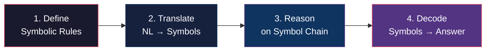
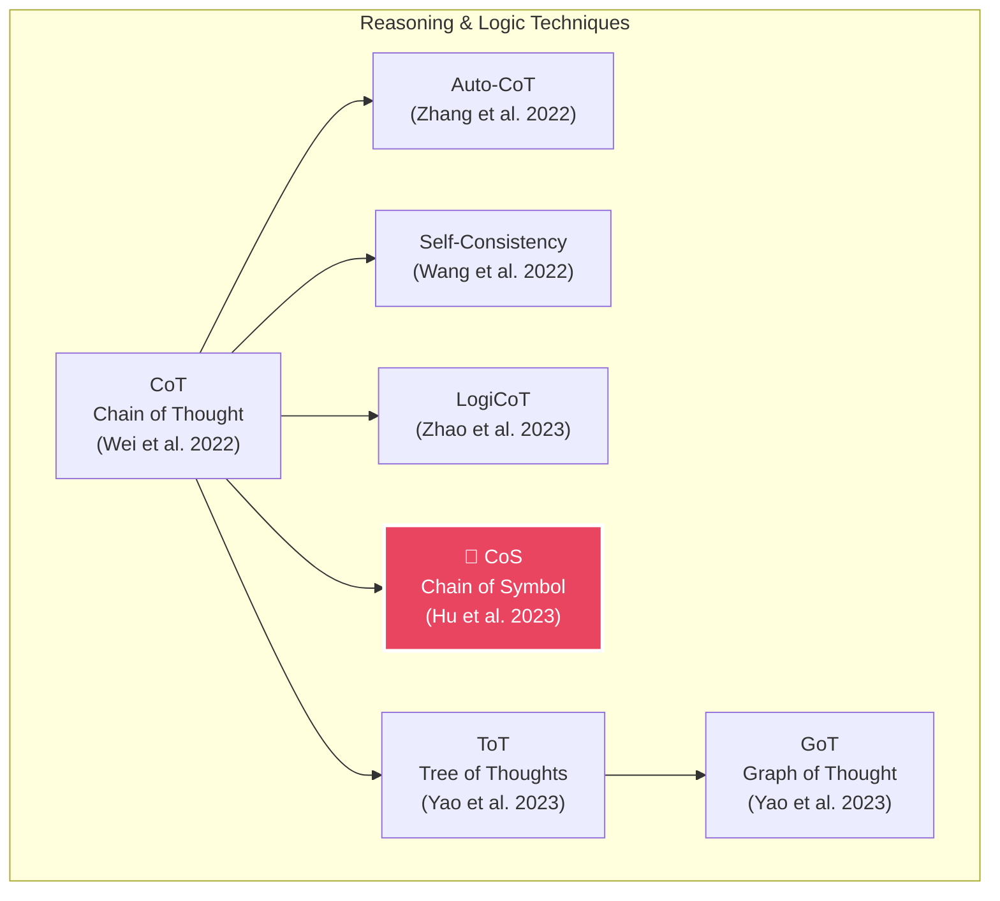
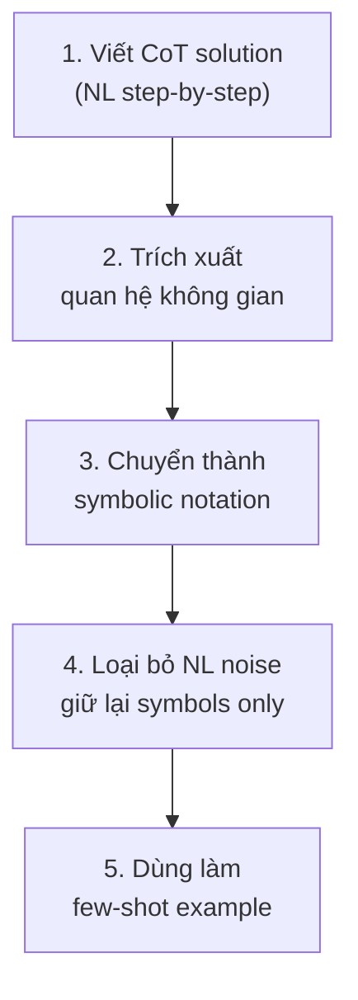

# Chain of Symbol (CoS) Prompting — Deep Dive

> **Paper gốc:** *"Chain-of-Symbol Prompting Elicits Planning in Large Language Models"* — Hu et al. (2023)
> **GitHub:** `hanxuhu/chain-of-symbol-planning`
> **Nguồn tổng hợp:** A Systematic Survey of Prompt Engineering (2402.07927v2) + web research

---

## 1. Vấn đề CoS giải quyết

LLM gặp khó khăn nghiêm trọng với **spatial reasoning** (suy luận không gian) khi môi trường được mô tả bằng ngôn ngữ tự nhiên:

| Thách thức | Giải thích |
|---|---|
| **Ambiguity** | Ngôn ngữ tự nhiên mơ hồ — "bên trái", "phía trên" có thể hiểu nhiều cách |
| **Redundancy** | Mô tả dài dòng, chứa nhiều từ không mang thông tin quan hệ |
| **Token waste** | Prompt dài → tốn context window, tăng latency và chi phí API |
| **Cognitive drift** | Qua nhiều bước suy luận bằng text, model dễ "lạc" khỏi trạng thái đúng |

> [!IMPORTANT]
> CoT (Chain of Thought) hoạt động tốt cho toán học và logic chung, nhưng **thất bại** ở spatial reasoning vì ngôn ngữ tự nhiên không phải công cụ tốt để biểu diễn quan hệ không gian.

---

## 2. Cơ chế hoạt động của CoS

### 2.1 Ý tưởng cốt lõi

Thay vì suy luận qua **chuỗi suy nghĩ bằng ngôn ngữ tự nhiên** (CoT), CoS chuyển đổi thông tin thành **chuỗi ký hiệu rút gọn** (symbols) rồi mới suy luận.

### 2.2 Quy trình 4 bước



| Bước | Mô tả | Ví dụ |
|------|--------|-------|
| **Define** | Thiết lập bộ ký hiệu cho quan hệ cụ thể | `←` = bên trái, `↑` = phía trên, `/` = trên đỉnh |
| **Translate** | Chuyển mô tả NL thành symbolic format | "Red is left of Blue" → `[Red] ← [Blue]` |
| **Reason** | Thao tác trên chuỗi ký hiệu | `[Red] ← [Blue] ← [Green]` → Red ở ngoài cùng bên trái |
| **Decode** | Trả kết quả cuối cùng bằng NL | "Red is the leftmost block" |

### 2.3 So sánh CoT vs CoS

```
┌─────────────────────────────────────────────────────────┐
│ CoT (Chain of Thought)                                  │
│                                                         │
│ "First, the red block is to the left of the blue block. │
│  Then, the green block is placed on top of the blue     │
│  block. Next, we need to move the yellow block to the   │
│  right of the green block..."                           │
│                                                         │
│ → Dài dòng, dễ mơ hồ, tốn token                       │
└─────────────────────────────────────────────────────────┘

┌─────────────────────────────────────────────────────────┐
│ CoS (Chain of Symbol)                                   │
│                                                         │
│ [Red] ← [Blue]                                          │
│ [Green] / [Blue]                                        │
│ [Yellow] → [Green]                                      │
│                                                         │
│ → Ngắn gọn, chính xác, ít token                        │
└─────────────────────────────────────────────────────────┘
```

---

## 3. Kết quả thực nghiệm

> Theo Survey Paper (2402.07927v2), Section 2.2:

### 3.1 Benchmark Brick World

| Metric | CoT (baseline) | CoS | Improvement |
|--------|:--------------:|:---:|:-----------:|
| **Accuracy (ChatGPT)** | 31.8% | **92.6%** | **+60.8%** |
| **Prompt tokens** | 100% | **34.2%** | **-65.8%** |

> [!TIP]
> CoS nâng accuracy từ **31.8% lên 92.6%** trên Brick World — gần gấp 3 lần — đồng thời giảm **65.8% token** trong prompt.

### 3.2 Các benchmark khác

Hu et al. đánh giá CoS trên nhiều spatial planning task:

| Benchmark | Mô tả |
|-----------|--------|
| **Brick World** | Sắp xếp khối trong không gian 1D/2D |
| **NLVR-based Manipulation** | Diễn giải ràng buộc Visual Reasoning để di chuyển vật |
| **Natural Language Navigation** | Lập kế hoạch đường đi qua các landmark |

---

## 4. Đặc tính kỹ thuật

### 4.1 Ưu điểm

| Ưu điểm | Chi tiết |
|----------|----------|
| ✅ **No fine-tuning** | In-context learning thuần túy, không cần train lại model |
| ✅ **Token efficiency** | Giảm tới 65.8% token → nhanh hơn, rẻ hơn |
| ✅ **Unambiguous** | Ký hiệu có ngữ nghĩa chính xác, không mơ hồ như NL |
| ✅ **Human auditable** | Chuỗi ký hiệu dễ đọc, dễ trace, dễ debug |
| ✅ **Dramatic accuracy gain** | +60.8% accuracy trên spatial tasks |

### 4.2 Hạn chế

> Trích từ Survey Paper:
> *"CoS suffers from challenges such as scalability, generalizability, integration with other techniques, and interpretability of LLM reasoning based on symbols."*

| Hạn chế | Chi tiết |
|---------|----------|
| ⚠️ **Scalability** | Bộ ký hiệu cần thiết kế riêng cho từng domain |
| ⚠️ **Generalizability** | Hiệu quả chủ yếu ở spatial reasoning, chưa chứng minh rộng |
| ⚠️ **Integration** | Khó kết hợp với các kỹ thuật prompting khác (ToT, GoT...) |
| ⚠️ **Symbol design** | Cần human effort để thiết kế symbolic language phù hợp |

---

## 5. Vị trí trong hệ sinh thái Prompt Engineering



### So sánh nhanh các kỹ thuật cùng nhóm

| Kỹ thuật | Biểu diễn suy luận | Thế mạnh | Accuracy gain |
|----------|---------------------|----------|:-------------:|
| **CoT** | NL step-by-step | Math, common sense | Baseline |
| **Auto-CoT** | Auto-gen NL chains | Giảm manual effort | +1.33% vs CoT |
| **Self-Consistency** | Multiple NL paths → vote | Robust reasoning | +17.9% (GSM8K) |
| **LogiCoT** | NL + logic verification | Logical reasoning | +1.42% (GSM8K) |
| **CoS** | **Condensed symbols** | **Spatial reasoning** | **+60.8% (Brick World)** |
| **ToT** | Tree of NL thoughts | Exploration tasks | +70% (Game of 24) |
| **GoT** | Graph of NL thoughts | Non-linear reasoning | +5.08% (GSM8K) |

---

## 6. Hướng dẫn triển khai thực tế

### 6.1 Khi nào nên dùng CoS?

- ✅ **Spatial planning** — sắp xếp, di chuyển, navigation
- ✅ **State tracking** — theo dõi trạng thái qua nhiều bước
- ✅ **Cost-sensitive** — cần giảm token/latency nhưng vẫn cần reasoning
- ✅ **Grid/map puzzles** — bài toán trên lưới, bản đồ
- ❌ **Math reasoning** — CoT hoặc PoT hiệu quả hơn
- ❌ **Open-ended generation** — không phù hợp với creative tasks

### 6.2 Template mẫu

```text
SYSTEM: You are a spatial reasoning assistant. 
Use symbolic notation for intermediate steps.

SYMBOL RULES:
- A ← B  : A is to the left of B
- A → B  : A is to the right of B  
- A / B  : A is on top of B
- A \ B  : A is below B
- A -- B : A is next to B

USER: There are 4 blocks: Red, Blue, Green, Yellow.
Red is to the left of Blue.
Green is on top of Blue.  
Yellow is to the right of Green.
Question: What is the spatial arrangement?

ASSISTANT (CoS reasoning):
Step 1: [Red] ← [Blue]
Step 2: [Green] / [Blue]  
Step 3: [Yellow] → [Green]

Final arrangement:
       [Green] [Yellow]
[Red]  [Blue]

Answer: Red is on the ground-left, Blue is on the ground-right 
of Red, Green is stacked on Blue, Yellow is to the right of Green.
```

### 6.3 Cách tạo few-shot examples cho CoS



---

## 7. Tóm tắt

> [!NOTE]
> **Chain of Symbol (CoS)** là kỹ thuật prompting chuyên biệt cho spatial reasoning, biến đổi thông tin không gian từ ngôn ngữ tự nhiên sang ký hiệu rút gọn trước khi suy luận. Đạt accuracy **92.6%** (vs 31.8% CoT) trên Brick World và giảm **65.8% token**. Hạn chế chính: cần thiết kế symbolic language riêng cho từng domain và chưa chứng minh hiệu quả rộng ngoài spatial tasks.

---

## 8. Ghi chú về tài liệu

| Tài liệu | Trạng thái | Nội dung CoS |
|-----------|------------|--------------|
| **Survey PDF** (2402.07927v2) | ✅ Đã đọc | Section 2.2 — mô tả đầy đủ CoS, lines 287-302 |
| **Blueprint PDF** | ⚠️ Image-based scan | Không trích xuất được text (15 trang dạng ảnh, 0 text blocks) |

---

## 9. Decision Record: CoS → Code-flavored Structured NL

> **Date**: 2026-04-05
> **Decision**: Dùng **Code-flavored Structured NL** thay vì CoS thuần (ký hiệu toán) cho dự án này.

### Lý do

| Criteria | CoS toán (∀, ∃, ⇒) | Code-style Structured NL | Winner |
|----------|:-------------------:|:------------------------:|:------:|
| Token savings | ~60% | ~45-55% | CoS |
| Agent comprehension | ⭐⭐⭐ | ⭐⭐⭐⭐⭐ | **Structured NL** |
| Human readability | ⭐⭐ | ⭐⭐⭐⭐ | **Structured NL** |
| Risk of misinterpretation | Medium | Low | **Structured NL** |
| Fits project content type | ❌ (rules, not spatial) | ✅ (instructions/rules) | **Structured NL** |

### Key insight
- CoS originates from spatial reasoning tasks (Brick World, navigation)
- Project files are 90% instructions/rules/conventions — NL territory
- LLMs trained ~85% on NL + ~10% code → code-style shorthand hits the sweet spot
- Convention defined in `cos_convention.md`
