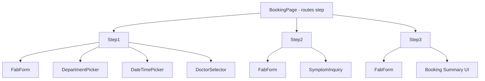

# Module: Booking — Đặt lịch khám

## §1 Responsibilities
- Luồng đặt lịch khám 3 bước (Step 1 → Step 2 → Step 3)
- Step 1: Chọn khoa + ngày/giờ + bác sĩ
- Step 2: Nhập mô tả triệu chứng + ảnh
- Step 3: Xác nhận thông tin + submit

## §2 Route

| Path | Component | Handle |
|------|-----------|--------|
| `/booking/:step?` | `BookingPage` | `back:true, title:"Đặt lịch khám"` |

`step` param: `1` (default), `2`, `3`

## §3 Component Tree



## §4 State Flow

```
bookingFormState (atomWithReset)
├── slot?: TimeSlot       ← Step 1 DateTimePicker
├── doctor?: Doctor       ← Step 1 DoctorSelector
├── department?: Department ← Step 1 DepartmentPicker
├── symptoms: string[]    ← Step 2 SymptomInquiry
├── description: string   ← Step 2 TextareaWithImageUpload
└── images: string[]      ← Step 2 TextareaWithImageUpload

availableTimeSlotsState → DateTimePicker (read-only)
```

## §5 Navigation Flow

```
/booking (→ Step 1 default)
    ↓ navigate("/booking/2", { viewTransition: true })
/booking/2 (Step 2)
    ↓ navigate("/booking/3", { viewTransition: true })
/booking/3 (Step 3)
    ↓ submit → navigate("/schedule") || toast.error
```

## §6 Validation Pattern
- `disabled={!formData.slot || !formData.department || !formData.doctor}` in Step 1
- `onDisabledClick: () => toast.error("Vui lòng điền đầy đủ thông tin!")`
- FabForm's Button handles disabled UX

## §7 Key Patterns
- `useParams()` to get `step` → array index lookup: `[Step1, Step2, Step3][step - 1]`
- `useAtom(bookingFormState)` — read+write (NOT useAtomValue)
- `useAtomValue(availableTimeSlotsState)` — read-only
- `useNavigate()` with `viewTransition: true` between steps

## §8 Files

| File | Purpose |
|------|---------|
| `src/pages/booking/index.tsx` | Step router (useParams → render step) |
| `src/pages/booking/step1.tsx` | Department + DateTime + Doctor selection |
| `src/pages/booking/step2.tsx` | Symptom description + images |
| `src/pages/booking/step3.tsx` | Review + submit |

xref: state.ts (bookingFormState, availableTimeSlotsState), components/form/
