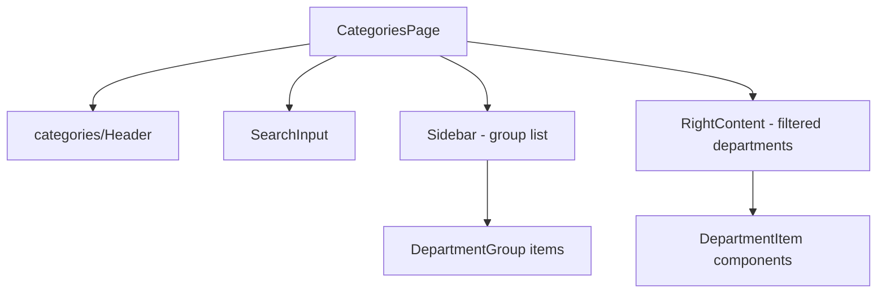

# Module: Categories — Danh mục khoa

## §1 Responsibilities
- Hiển thị danh mục khoa theo nhóm (hierarchy)
- Sidebar: danh sách DepartmentGroup
- Right content: Department list cho group đang chọn, có thể filter bằng keyword
- Handle `noScroll: true` → overflow managed internally (không phụ thuộc Page wrapper scroll)

## §2 Route

| Path | Component | Handle |
|------|-----------|--------|
| `/categories` | `CategoriesPage` | `back:true, title:"Danh mục", noScroll:true` |

## §3 Component Tree



## §4 State Flow

```
departmentHierarchyState (computed atom)
  = departmentGroupsState + departmentsState joined
  ↓
Sidebar: renders groups
  ↓ user selects group (local selectedGroup state)
RightContent: renders deps filtered by groupId + keyword

Local state:
  keyword: string (useState) → passed to RightContent as prop
  selectedGroup: likely in Sidebar/RightContent or lifted to CategoriesPage
```

## §5 Key Patterns
- `noScroll:true` handle → Page container does NOT overflow-y-auto → internal scroll managed
- Keyword filter via local `useState` (NOT Jotai — transient UI state)
- `departmentHierarchyState` uses `atomWithDefault`/computed for hierarchy join

## §6 Files

| File | Purpose |
|------|---------|
| `src/pages/categories/index.tsx` | Page shell — keyword state + layout |
| `src/pages/categories/header.tsx` | Page-specific header section |
| `src/pages/categories/sidebar.tsx` | Group list nav |
| `src/pages/categories/right-content.tsx` | Department list, filterable |

xref: state.ts (departmentHierarchyState, departmentsState, departmentGroupsState), components/items/department
