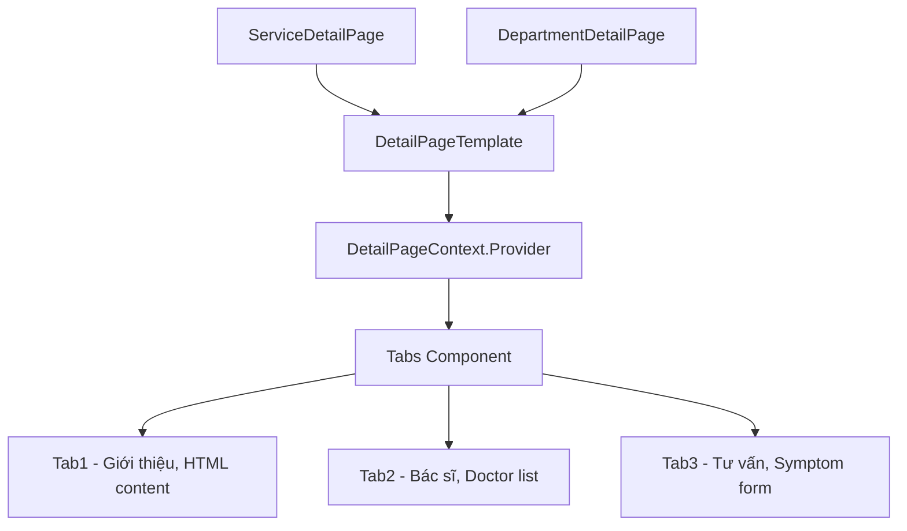

# Module: Detail Pages — Service & Department Detail

## §1 Responsibilities
- Hiển thị chi tiết dịch vụ y tế hoặc khoa khám
- 3 tab: Giới thiệu (HTML content), Bác sĩ (danh sách), Tư vấn (form câu hỏi)
- Dynamic title từ Jotai `customTitleState` atom
- URL params: `?tab=N` (default tab), `?doctor=N` (pre-select doctor)

## §2 Routes

| Path | Component | Handle |
|------|-----------|--------|
| `/service/:id` | `ServiceDetailPage` | `back:true, title:"custom"` |
| `/department/:id` | `DepartmentDetailPage` | `back:true, title:"custom"` |

> `title:"custom"` → Header reads from `customTitleState` Jotai atom

## §3 Component Tree



## §4 State & Context Flow

```
URL params:
  :id → useParams() → serviceByIdState(id) / departmentByIdState(id)
  ?tab → useSearchParams() → activeTab state
  ?doctor → pre-select doctor in Tab2

Jotai:
  customTitleState ← setCustomTitle(props.title) on mount, cleaned up on unmount
  symptomFormState ← Tab3 form data

React Context:
  DetailPageContext.Provider passes DetailPageTemplateProps to all tabs
  Tabs read via useContext(DetailPageContext)
```

## §5 Data Flow

```
useParams({ id }) → Number(id)
  ↓
serviceByIdState(numericId) → Service | undefined
  ↓
ServiceDetailPage builds DetailPageTemplateProps:
  { title: service.name, tab1: { htmlContent }, tab2: { department }, tab3: { formData } }
  ↓
DetailPageTemplate renders with Tabs + Context
```

## §6 Key Patterns
- Shared template: `DetailPageTemplate` used by BOTH ServiceDetail + DepartmentDetail
- `React.createContext({} as T)` for page-level data sharing between tabs
- `customTitleState` cleanup pattern: save old title on mount, restore on unmount
- `useSearchParams()` for tab control (URL-driven active tab)

## §7 Files

| File | Purpose |
|------|---------|
| `src/pages/detail/service.tsx` | ServiceDetailPage — fetches service by ID |
| `src/pages/detail/department.tsx` | DepartmentDetailPage — fetches department by ID |
| `src/pages/detail/template.tsx` | Shared template with Tabs + Context.Provider |
| `src/pages/detail/context.ts` | `DetailPageContext` + `DetailPageTemplateProps` interface |
| `src/pages/detail/tab1.tsx` | Giới thiệu — renders htmlContent safely |
| `src/pages/detail/tab2.tsx` | Bác sĩ — doctor list for department |
| `src/pages/detail/tab3.tsx` | Tư vấn — symptom inquiry form |

xref: state.ts (serviceByIdState, departmentByIdState, customTitleState, symptomFormState), components/tabs, components/form/symptom-inquiry
