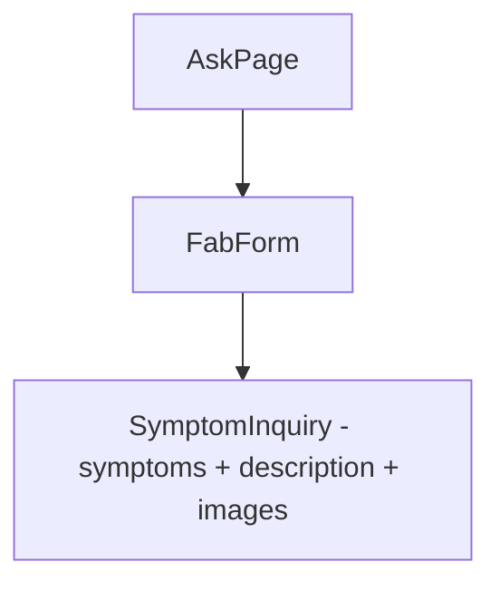
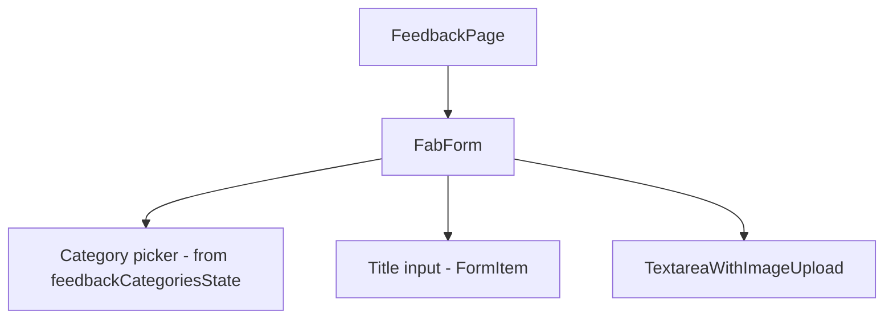

# Module: Forms — Ask & Feedback

## §1 Responsibilities
- Ask (`/ask`): Gửi câu hỏi với triệu chứng + mô tả + ảnh
- Feedback (`/feedback`): Gửi phản ảnh với category + tiêu đề + mô tả + ảnh

## §2 Routes

| Path | Component | Handle |
|------|-----------|--------|
| `/ask` | `AskPage` | `back:true, title:"Gửi câu hỏi"` |
| `/feedback` | `FeedbackPage` | `back:true, title:"Gửi phản ảnh"` |

## §3 Component Trees

### Ask Page


### Feedback Page


## §4 State Flow

### Ask
```
askFormState (atomWithReset<Inquiry>)
├── symptoms: string[]
├── description: string
├── images: string[]
└── department?: Department  (added via Inquiry extends SymptomDescription)

symptomsState → SymptomInquiry component (symptom chips)
```

### Feedback
```
feedbackFormState (atomWithReset<Feedback>)
├── category: string         ← feedbackCategoriesState options
├── title: string
├── description: string
└── images: string[]

feedbackCategoriesState → category picker options
```

## §5 FabForm Pattern
```tsx
// FabForm = floating action bar at bottom + scrollable content
<FabForm
  fab={{
    children: "Gửi",
    disabled: !formData.category || !formData.title,
    onClick: handleSubmit,
    onDisabledClick: () => toast.error("Vui lòng điền đầy đủ!")
  }}
>
  {/* Form fields */}
</FabForm>
```

## §6 Reset Pattern
Both forms use `useResetAtom` from `jotai/utils`:
```typescript
const resetForm = useResetAtom(askFormState);
// Called after successful submit
```

## §7 Files

| File | Purpose |
|------|---------|
| `src/pages/ask/index.tsx` | AskPage — inquiry form |
| `src/pages/feedback/index.tsx` | FeedbackPage — feedback form |
| `src/components/form/symptom-inquiry.tsx` | Symptom + description + images |
| `src/components/form/textarea-with-image-upload.tsx` | Text area + image |
| `src/components/form/fab-form.tsx` | Floating action bottom bar |
| `src/components/form/item.tsx` | Form field wrapper |

xref: state.ts (askFormState, feedbackFormState, symptomsState, feedbackCategoriesState), components/form/
