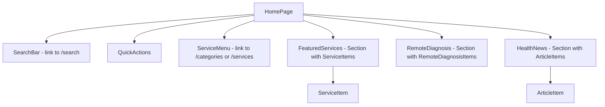

# Module: Home — Trang chủ

## §1 Responsibilities
- Landing page chính của app — hiển thị khi vào `/`
- Composite của nhiều section: search bar, quick actions, service menu, featured services, remote diagnosis, health news
- Header ở mode chính (gradient background + shield icon + app title)
- Footer hiển thị tab navigation

## §2 Route

| Path | Component | Handle |
|------|-----------|--------|
| `/` | `HomePage` | — (main header, footer visible) |

## §3 Component Tree



## §4 State Flow

```
servicesState → FeaturedServices (useAtomValue)
articlesState → HealthNews (useAtomValue)
[no state for QuickActions, ServiceMenu — static content]
```

## §5 Key Patterns
- Fully composite — HomePage itself has no logic, just composes sub-modules
- Sub-modules each `useAtomValue()` their own atoms
- `<Section viewMore="/services">` uses TransitionLink internally
- SearchBar is a link to `/search` (no inline search on home)

## §6 Files

| File | Purpose |
|------|---------|
| `src/pages/home/index.tsx` | HomePage — composes all sections |
| `src/pages/home/quick-actions.tsx` | Quick action grid (links to services) |
| `src/pages/home/service-menu.tsx` | Main service category menu |
| `src/pages/home/featured-services.tsx` | Featured service cards |
| `src/pages/home/service-highlight.tsx` | Highlighted service section |
| `src/pages/home/remote-diagnosis.tsx` | Remote diagnosis section |
| `src/pages/home/health-news.tsx` | Health news articles |
| `src/pages/search/search-bar.tsx` | Search input (used on home + search page) |

xref: state.ts (servicesState, articlesState), components/section, components/items/
