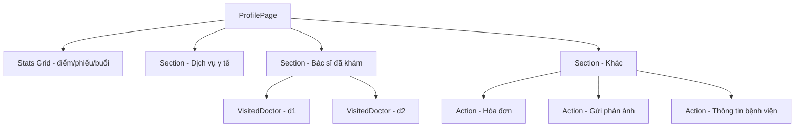

# Module: Profile — Hồ sơ cá nhân

## §1 Responsibilities
- Hiển thị thống kê cá nhân (điểm thưởng, phiếu giảm giá, buổi khám)
- Hiển thị dịch vụ y tế (quick links)
- Hiển thị bác sĩ đã khám gần đây
- Quick links: Hóa đơn, Gửi phản ảnh, Thông tin bệnh viện
- `handle.profile = true` → Header renders profile variant (avatar + name)

## §2 Route

| Path | Component | Handle |
|------|-----------|--------|
| `/profile` | `ProfilePage` | `profile:true` |

> Footer visible, `profile:true` → Header shows user avatar + name (reads `userState` atom)

## §3 Component Tree



## §4 State Flow

```
doctorsState → profilePage read d1, d2 (first 2 doctors)
userState → Header reads (via handle.profile=true)
```

## §5 Profile Header Pattern
```typescript
// handle.profile = true → Header shows:
const user = useAtomValue(userState);  // ZMP SDK getUserInfo()
<avatar>{user.avatar}</avatar>
<name>{user.name}</name>
```

## §6 Sub-Components

| Component | File | Purpose |
|-----------|------|---------|
| `Action` | `src/pages/profile/action.tsx` | Tappable row with label + icon + badge + `to` (TransitionLink) |
| `VisitedDoctor` | `src/pages/profile/visited-doctor.tsx` | Doctor card showing name + specialty |

## §7 Key Patterns
- Stats hardcoded as inline data arrays (not from atoms) — static mock display
- Icons from `@/static/services/` SVG files (NOT icon components)
- `Section viewMore="/services"` links to services listing
- `Action to="/invoices"` uses TransitionLink for navigation

## §8 Files

| File | Purpose |
|------|---------|
| `src/pages/profile/index.tsx` | ProfilePage — stats + sections |
| `src/pages/profile/action.tsx` | Action row component |
| `src/pages/profile/visited-doctor.tsx` | Visited doctor card |

xref: state.ts (doctorsState, userState), components/section, components/transition-link
