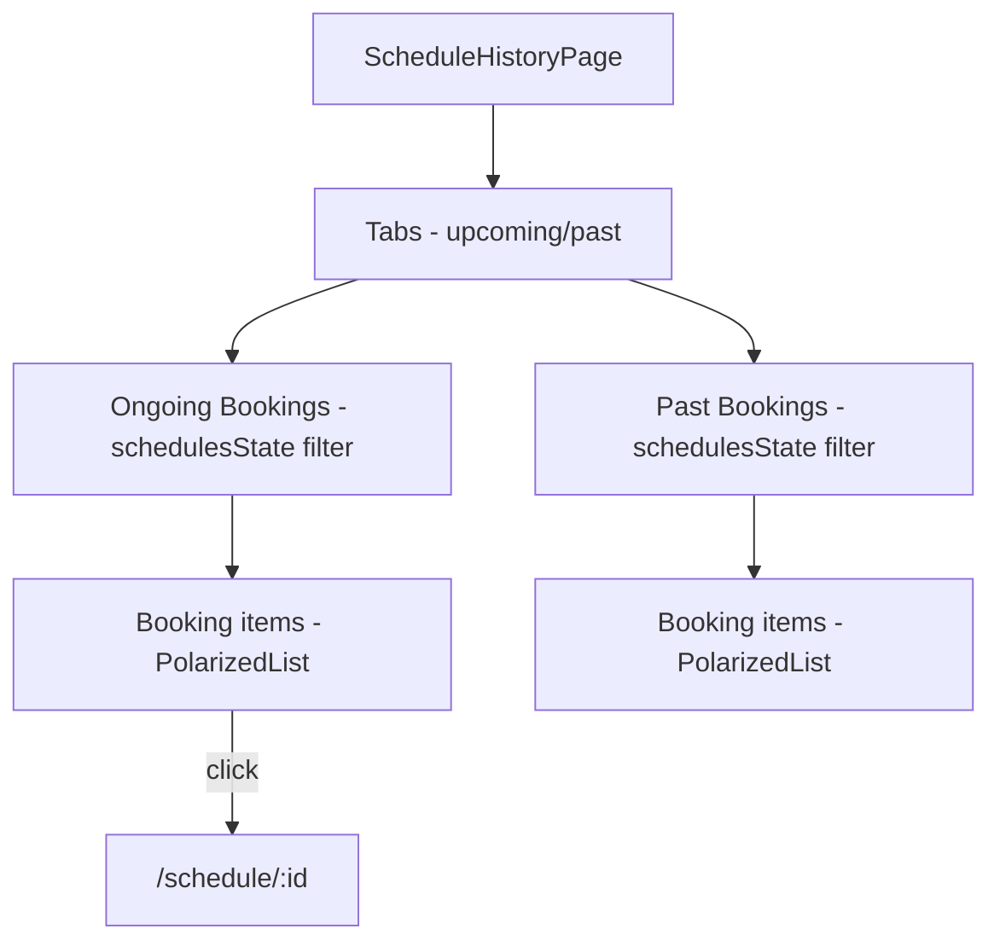
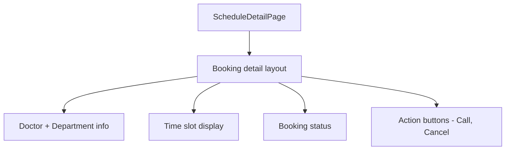

# Module: Schedule & Invoices

## §1 Schedule Routes

| Path | Component | Handle |
|------|-----------|--------|
| `/schedule` | `ScheduleHistoryPage` | — (footer visible) |
| `/schedule/:id` | `ScheduleDetailPage` | `back:true, title:"Chi tiết"` |

## §2 Invoices Route

| Path | Component | Handle |
|------|-----------|--------|
| `/invoices` | `InvoicesPage` | `back:true, title:"Hóa đơn"` |

> Accessed from: Profile page → Action "Hóa đơn của tôi" (badge: 3)

## §3 Component Trees

### Schedule History


### Schedule Detail


## §4 State Flow

```
schedulesState (atom<Promise<Booking[]>>)
  ↓
ScheduleHistoryPage → filter by status (upcoming/past)
scheduleByIdState(id) (atomFamily)
  ↓
ScheduleDetailPage → full booking detail
invoicesState (atom<Promise<Invoice[]>>)
  ↓
InvoicesPage → invoice list
  → Invoice.booking.id links to schedule detail
```

## §5 Booking Status Pattern

```typescript
// Booking.status: "upcoming" | "completed" | "cancelled" | etc.
const upcoming = schedules.filter(s => s.status === "upcoming");
const past = schedules.filter(s => s.status !== "upcoming");
```

## §6 Invoice Structure

```typescript
interface Invoice {
  id: number;
  booking: Booking;  // embedded booking reference
}
// InvoicesPage renders Invoice.booking summary
// Click → navigate to booking detail or separate invoice detail
```

## §7 Files

| File | Purpose |
|------|---------|
| `src/pages/schedule/history.tsx` | ScheduleHistoryPage |
| `src/pages/schedule/detail.tsx` | ScheduleDetailPage |
| `src/pages/invoices/index.tsx` | InvoicesPage |

xref: state.ts (schedulesState, scheduleByIdState, invoicesState), components/polarized-list
