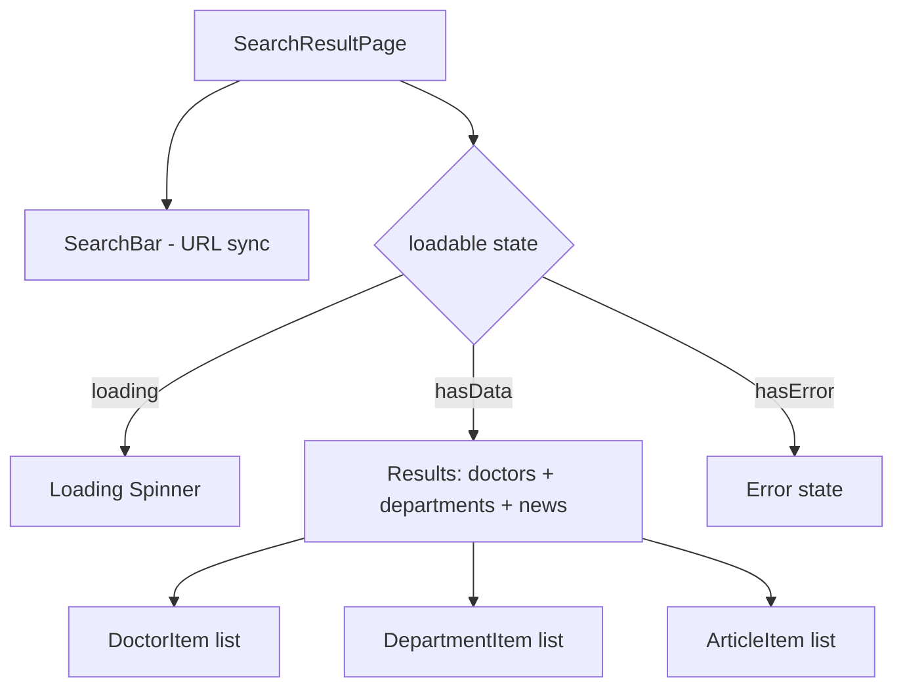

# Module: Search — Tìm kiếm

## §1 Responsibilities
- Search bar (dùng lại ở Home)
- Search result page với keyword từ URL params
- Search qua: doctors, departments, articles (news)
- Accent-insensitive Vietnamese search (`toLowerCaseNonAccentVietnamese`)
- Simulated 1500ms delay để test loading state

## §2 Route

| Path | Component | Handle |
|------|-----------|--------|
| `/search` | `SearchResultPage` | — (main header, footer visible) |

## §3 Component Tree



## §4 State Flow

```
URL: /search?q=keyword
  ↓
useSearchParams() → keyword
  ↓
searchResultState(keyword) — atomFamily + loadable
  = wait(1500ms) → filter doctors, departments, articles
  Returns: loadable { state, data: { doctors, departments, news } }
  ↓
Render by state:
  "loading" → spinner
  "hasData" → grouped results
  "hasError" → error UI
```

## §5 Search Algorithm
```typescript
// src/state.ts — searchResultState
const kw = toLowerCaseNonAccentVietnamese(keyword.toLowerCase());
doctors.filter(d => toLowerCaseNonAccentVietnamese(d.name).includes(kw))
departments.filter(d => toLowerCaseNonAccentVietnamese(d.name).includes(kw))
articles.filter(a => toLowerCaseNonAccentVietnamese(a.title).includes(kw))
```

## §6 SearchBar Pattern

```typescript
// src/pages/search/search-bar.tsx
// Used on: HomePage (className="mx-4") + SearchResultPage (syncs URL ?q=)
// On HomePage: click → navigate("/search") with query param
// On SearchResultPage: input change → setSearchParams({ q: value })
```

## §7 Key Patterns
- `loadable()` prevents ErrorBoundary cascade — handles error inline
- `atomFamily(keyword)` — separate atom instance per keyword string
- `wait(1500)` — simulates API latency (remove when connecting real API)
- `useSearchParams()` for URL-driven search state

## §8 Files

| File | Purpose |
|------|---------|
| `src/pages/search/index.tsx` | SearchResultPage — keyword + results |
| `src/pages/search/search-bar.tsx` | Shared search input component |

xref: state.ts (searchResultState), utils/miscellaneous (toLowerCaseNonAccentVietnamese), components/items/
