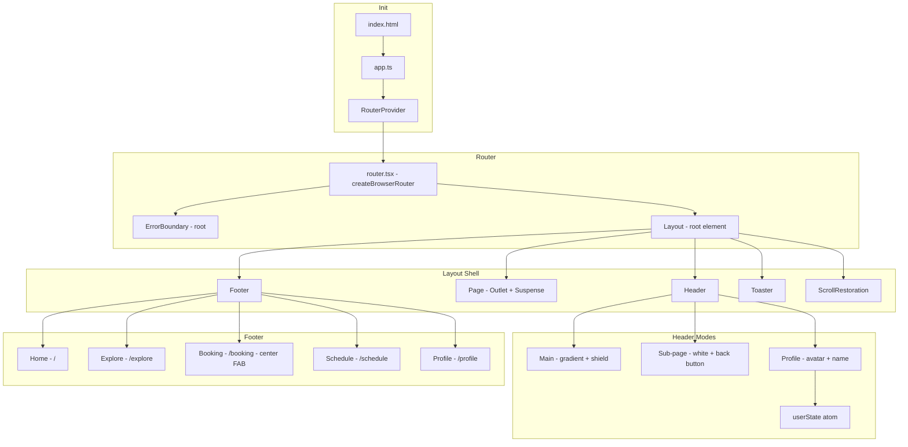

# Module: App Shell — Routing & Layout

## §1 Responsibilities
- Entry point initialization + router setup
- Layout shell: Header + Page (Outlet) + Footer + Toast + ScrollRestoration
- Dynamic header (main / sub-page / profile variant)
- Tab navigation footer
- Route-level error handling
- View Transition API integration

## §2 Files Overview

| File | Role |
|------|------|
| `src/app.ts` | Entry — `createRoot` + `RouterProvider` |
| `src/router.tsx` | Route config — `createBrowserRouter` + `getBasePath()` |
| `src/hooks.ts` | `useRouteHandle()` + `useRealHeight()` |
| `src/components/layout.tsx` | Shell — Header + Page + Footer + Toast + Scroll |
| `src/components/header.tsx` | Dynamic header |
| `src/components/footer.tsx` | Tab nav |
| `src/components/page.tsx` | `<Outlet>` + `<Suspense>` |
| `src/components/scroll-restoration.tsx` | Manual scroll position map |
| `src/components/error-boundary.tsx` | Route ErrorBoundary |
| `src/components/transition-link.tsx` | `<NavLink viewTransition>` |
| `src/pages/404.tsx` | Not found → navigate(-1) |

## §3 Shell Architecture



## §4 Route Handle System

```typescript
// Defined per route in router.tsx:
handle: { back?: boolean; title?: string; noScroll?: boolean; profile?: boolean }

// useRouteHandle() in hooks.ts:
const matches = useMatches() as UIMatch<>;
const lastMatch = matches[matches.length - 1];
return [lastMatch.handle ?? {}, lastMatch, matches] as const;

// Consumed by:
//   Header → back, title, profile
//   Footer → back (hidden when back=true)
//   Page → noScroll
//   ScrollRestoration → scrollRestoration
```

## §5 Base Path (Zalo Environment)

```typescript
export function getBasePath() {
  const urlParams = new URLSearchParams(window.location.search);
  const env = urlParams.get("env");

  // Zalo prod OR test environments → /zapps/${APP_ID}
  if (import.meta.env.PROD ||
      ["TESTING_LOCAL", "TESTING", "DEVELOPMENT"].includes(env)) {
    return `/zapps/${window.APP_ID}`;
  }

  // Local dev → window.BASE_PATH || ""
  return window.BASE_PATH || "";
}
```

## §6 View Transition Integration

```typescript
// TransitionLink → NavLink + viewTransition prop
<NavLink {...props} viewTransition />

// Programmatic navigation with transition
navigate("/route", { viewTransition: true });

// CSS: View Transition API (::view-transition-old, ::view-transition-new)
// in app.scss or tailwind
```

## §7 Error Recovery Flow

```
Route throws error
  ↓
ErrorBoundary.useRouteError()
  ↓
  instanceof NotifiableError?
    YES → toast.error(message) + resetUser()
    NO  → console.warn(error)
  ↓
<NotFound noToast /> → navigate(-1, { viewTransition: true })
```

xref: all modules, state.ts (userState), utils (miscellaneous, errors)
