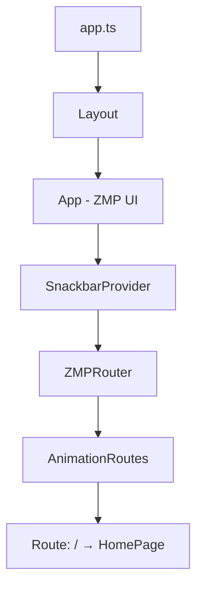

# React Architecture — pretty-little-shop-vn

## §1 Tech Stack

| Tech | Version | Config File |
|------|---------|-------------|
| React | ^18.3.1 | package.json |
| TypeScript | strict | tsconfig.json |
| Vite | ^5.2.13 | vite.config.mts |
| react-router-dom | ^6.x | package.json |
| Jotai | ^2.12.1 | package.json |
| ZMP SDK | latest | package.json |
| ZMP UI | latest | package.json |
| Tailwind CSS | ^3.4.3 | tailwind.config.js |
| SCSS | ^1.76.0 | package.json |
| autoprefixer | ^10.4.19 | package.json |
| PostCSS | ^8.4.38 | package.json |

## §2 Entry Point Flow

```
index.html → src/app.ts → Provider(Jotai) → Layout → MemoryRouter → Pages
```

### `src/app.ts` (entry)
1. Import CSS: `zaui.css` → `@/css/tailwind.scss` → `@/css/app.scss`
2. Import React: `React`, `createRoot` from `react-dom/client`
3. Import Layout: `@/components/layout`
4. Load config: `app-config.json` → `window.APP_CONFIG`
5. Mount: `createRoot(document.getElementById("app")!).render(React.createElement(Layout))`

> ⚠️ `window.APP_CONFIG = appConfig as any` — uses `any` cast

## §3 Build & Config

### `vite.config.mts`
| Key | Value |
|-----|-------|
| root | `./src` |
| base | `""` |
| plugins | `zaloMiniApp()`, `react()` |
| assetsInlineLimit | `0` |
| resolve.alias | `@` → `/src` |

### `tsconfig.json`
| Key | Value |
|-----|-------|
| target | es6 |
| jsx | react-jsx |
| strict | true |
| noImplicitAny | false |
| paths | `@/*` → `./src/*` |
| types | `vite/client` |

### `app-config.json`
| Key | Value |
|-----|-------|
| title | "Pretty Little Shop Vn" |
| textColor.light | "black" |
| textColor.dark | "white" |
| statusBar | "transparent" |
| actionBarHidden | true |
| hideIOSSafeAreaBottom | true |

### `package.json` scripts
| Script | Command |
|--------|---------|
| login | `zmp login` |
| start | `zmp start` |
| deploy | `zmp deploy` |

## §4 Routing

| Route | Component | File |
|-------|-----------|------|
| `/` | `HomePage` | `src/pages/index.tsx` |

Pattern: `app.ts(Provider)` → `Layout(App)` → `SnackbarProvider` → `MemoryRouter` → `Routes` → `Route`

```tsx
// src/app.ts — Jotai Provider wrap (future-proof)
import { Provider } from 'jotai';
createRoot(...).render(<Provider><Layout /></Provider>);

// src/components/layout.tsx
import { MemoryRouter, Routes, Route, Navigate } from 'react-router-dom';
import { ROUTES } from '@/constants/routes';

<App theme={getSystemInfo().zaloTheme as AppProps['theme']}>
  <SnackbarProvider>
    <MemoryRouter>
      <Routes>
        <Route path={ROUTES.HOME} element={<HomePage />} />
        <Route path="*" element={<Navigate to={ROUTES.HOME} replace />} />
      </Routes>
    </MemoryRouter>
  </SnackbarProvider>
</App>
```

> ⚠️ MUST use `MemoryRouter` — Zalo WebView blocks HTML5 History API
> ✅ Keep `App` + `SnackbarProvider` from `zmp-ui` — Zalo platform requirement

## §5 Styling System

### Tailwind Config (`tailwind.config.js`)
| Key | Value |
|-----|-------|
| darkMode | `["selector", '[zaui-theme="dark"]']` |
| purge.content | `./src/**/*.{js,jsx,ts,tsx,vue}` |
| theme.extend.fontFamily.mono | `["Roboto Mono", "monospace"]` |

### CSS Import Order (in `app.ts`)
1. `zmp-ui/zaui.css` — ZMP UI base styles
2. `@/css/tailwind.scss` — Tailwind directives (`@tailwind base/components/utilities`)
3. `@/css/app.scss` — Custom app styles

### Custom SCSS (`app.scss`)
- `.page` — padding: 16px 16px 96px 16px
- `.section-container` — padding, bg-white, border-radius, margin-bottom
- `.zaui-list-item` — cursor: pointer

> ⚠️ Hardcoded `#ffffff` → should migrate to Tailwind `bg-white`

## §6 Folder Structure

```
src/
├── app.ts                    # Entry point — CSS + React mount
├── components/               # Shared/reusable components
│   ├── layout.tsx           # App shell (App, ZMPRouter, providers)
│   ├── clock.tsx            # Real-time clock component
│   └── logo.tsx             # SVG logo component
├── pages/                    # Route-level page components
│   └── index.tsx            # HomePage — default route "/"
├── css/
│   ├── tailwind.scss        # Tailwind directives
│   └── app.scss             # Custom app styles
└── static/                   # Static assets
    └── bg.svg               # Background image
```

### Expected dirs (not yet created):
- `src/hooks/` — Custom React hooks
- `src/stores/` — Jotai atom definitions
- `src/services/` — API service functions
- `src/utils/` — Utility/helper functions
- `src/types/` — TypeScript type definitions
- `src/constants/` — App constants (🔴 NEEDED: hardcoded appId exists)

## §7 Architecture Pattern



| Layer | Pattern | Example |
|-------|---------|---------|
| Entry | createRoot + Jotai Provider | `app.ts` |
| Shell | Function component + providers | `layout.tsx` |
| Routing | `MemoryRouter + Routes + Route` from react-router-dom | `layout.tsx` |
| Route Constants | `ROUTES` const + `AppRoute` type | `src/constants/routes.ts` |
| Pages | Function component + default export | `pages/index.tsx` |
| Components | Function component + typed props | `clock.tsx`, `logo.tsx` |
| Styling | Tailwind CSS + SCSS | `tailwind.scss`, `app.scss` |
| State | Jotai atoms (Provider ready, atoms TBD) | `app.ts` |
| Config | app-config.json + zmp-cli.json | root |

xref: react_component, react_state_service, zmp_sdk
