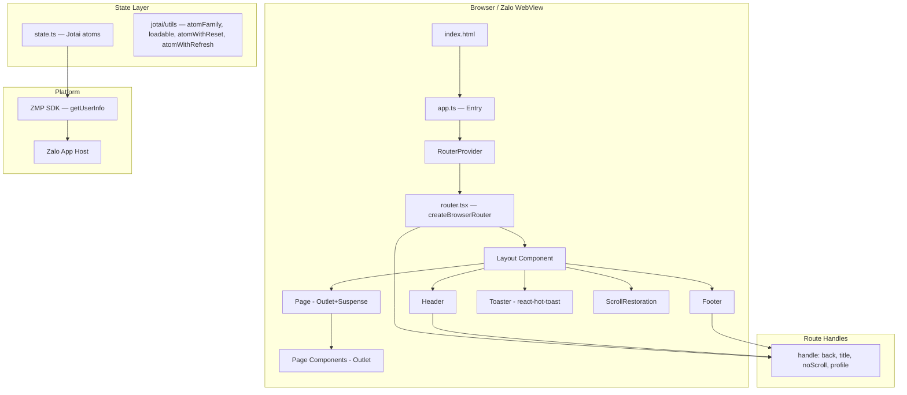

# React Architecture — pretty-little-shop-vn

## §1 Tech Stack

| Tech | Version | Config File |
|------|---------|-------------|
| React | ^18.3.1 | package.json |
| TypeScript | strict | tsconfig.json |
| Vite | ^5.2.13 | vite.config.mts |
| react-router-dom | **^7.6.1** | package.json |
| react-hot-toast | ^2.5.2 | package.json |
| Jotai | ^2.12.1 | package.json |
| ZMP SDK | latest | package.json |
| ZMP UI | ^1.11.7 | package.json |
| Tailwind CSS 3 | ^3.4.3 | tailwind.config.js |
| SCSS | ^1.76.0 | package.json |
| autoprefixer | ^10.4.19 | package.json |
| PostCSS | ^8.4.38 | package.json |
| @vitejs/plugin-react | ^4.3.1 | vite.config.mts |
| zmp-vite-plugin | latest | vite.config.mts |

> ⚠️ react-router-dom v7 (NOT v6) — breaking changes from v6 possible

## §2 Entry Point Flow

```
index.html → src/app.ts → RouterProvider(router) → Layout → Header+Page+Footer
```

### `src/app.ts` (entry point)
```typescript
import { createElement } from "react";
import { createRoot } from "react-dom/client";
import { RouterProvider } from "react-router-dom";
import router from "@/router";  // createBrowserRouter
// CSS: zaui.min.css → tailwind.scss → app.scss
// Config: window.APP_CONFIG = appConfig
createRoot(document.getElementById("app")!).render(createElement(RouterProvider, { router }));
```

> ✅ No Jotai Provider in app.ts — Jotai 2.x supports providerless mode (global store without Provider)
> ⚠️ `app.ts` NOT `.tsx` — uses `createElement` instead of JSX

## §3 Architecture Diagram



## §4 Routing Architecture

### Router: `createBrowserRouter` with basename
```typescript
// src/router.tsx
const router = createBrowserRouter([...], { basename: getBasePath() });

export function getBasePath() {
  // PROD / TESTING_LOCAL / TESTING / DEVELOPMENT → /zapps/${APP_ID}
  // DEV local → window.BASE_PATH || ""
}
```

> ⚠️ `createBrowserRouter` (NOT MemoryRouter) — Zalo production uses `/zapps/${APP_ID}` basename
> ✅ `ErrorBoundary` attached at root route level

### Route Map

| Path | Component | Handle |
|------|-----------|--------|
| `/` | `HomePage` | — |
| `/search` | `SearchResultPage` | — |
| `/categories` | `CategoriesPage` | `back:true, title:"Danh mục", noScroll:true` |
| `/explore` | `ExplorePage` | — |
| `/services` | `ServicesPage` | `back:true, title:"Tất cả dịch vụ"` |
| `/service/:id` | `ServiceDetailPage` | `back:true, title:"custom"` |
| `/department/:id` | `DepartmentDetailPage` | `back:true, title:"custom"` |
| `/booking/:step?` | `BookingPage` | `back:true, title:"Đặt lịch khám"` |
| `/ask` | `AskPage` | `back:true, title:"Gửi câu hỏi"` |
| `/feedback` | `FeedbackPage` | `back:true, title:"Gửi phản ảnh"` |
| `/schedule` | `ScheduleHistoryPage` | — |
| `/schedule/:id` | `ScheduleDetailPage` | `back:true, title:"Chi tiết"` |
| `/profile` | `ProfilePage` | `profile:true` |
| `/news/:id` | `NewsPage` | `back:true, title:"Tin tức"` |
| `/invoices` | `InvoicesPage` | `back:true, title:"Hóa đơn"` |
| `*` | `NotFound` | — |

### Route Handle Pattern
```typescript
// Route handle props
handle: { back?: boolean; title?: string; noScroll?: boolean; profile?: boolean }

// Usage via useRouteHandle() custom hook (src/hooks.ts)
const [handle] = useRouteHandle();
if (handle.back) { /* sub-page layout */ }
if (handle.title === "custom") { /* read from customTitleState atom */ }
```

## §5 Folder Structure

```
src/
├── app.ts              — Entry point (createRoot + RouterProvider)
├── router.tsx          — createBrowserRouter + route config
├── state.ts            — All Jotai atoms (listings, forms, detail, computed)
├── hooks.ts            — Custom hooks (useRealHeight, useRouteHandle)
├── types.d.ts          — Domain TypeScript interfaces
├── global.d.ts         — Window augmentation (APP_ID, BASE_PATH, APP_CONFIG)
├── components/
│   ├── layout.tsx      — App shell (Header + Page + Footer + Toaster)
│   ├── header.tsx      — Dynamic header (main / back / profile)
│   ├── footer.tsx      — Tab navigation bar (5 items)
│   ├── page.tsx        — Outlet wrapper with Suspense
│   ├── scroll-restoration.tsx — Manual scroll position management
│   ├── error-boundary.tsx     — React Router ErrorBoundary
│   ├── transition-link.tsx    — NavLink + viewTransition API
│   ├── button.tsx      — Custom Button with loading state
│   ├── section.tsx     — Section wrapper with header + viewMore
│   ├── tabs.tsx        — Tab switcher component
│   ├── dashed-divider.tsx, horizontal-divider.tsx
│   ├── marked-title-section.tsx, polarized-list.tsx
│   ├── remote-diagnosis-item.tsx
│   ├── icons/          — SVG icon components (16 icons)
│   ├── items/          — Data item components (article, department, doctor, service)
│   └── form/           — Form components (date-time-picker, department-picker, etc.)
├── pages/
│   ├── 404.tsx         — NotFound (navigate(-1) + toast)
│   ├── home/           — Homepage with sections
│   ├── booking/        — Multi-step booking flow (step1, step2, step3)
│   ├── categories/     — Category listing + sidebar
│   ├── detail/         — Service + Department detail pages
│   ├── explore/        — Explore/discovery page
│   ├── feedback/       — Feedback form
│   ├── ask/            — Ask question form
│   ├── invoices/       — Invoice listing
│   ├── news/           — News article detail
│   ├── profile/        — User profile
│   ├── schedule/       — Appointment history + detail
│   ├── search/         — Search results + search bar
│   └── services/       — All services listing
├── utils/
│   ├── format.ts       — formatPrice, formatDate, formatTimeSlot, etc.
│   ├── errors.ts       — NotifiableError class
│   ├── mock.ts         — Mock data for all entities
│   └── miscellaneous.tsx — getConfig, wait, startViewTransition, promptJSON, toLowerCaseNonAccentVietnamese
├── static/             — Images, SVGs (doctors, services, explore, etc.)
└── css/
    ├── tailwind.scss   — Tailwind directives
    └── app.scss        — Custom SCSS overrides
```

## §6 Architecture Patterns

| Layer | Pattern | Example |
|-------|---------|---------|
| Entry | `createElement(RouterProvider, { router })` | `app.ts` |
| Router | `createBrowserRouter` + basename | `router.tsx` |
| Shell | Header + Page(Outlet) + Footer | `layout.tsx` |
| Route Handles | `handle` object + `useRouteHandle()` | `hooks.ts`, `header.tsx` |
| State | Jotai atoms (providerless, global store) | `state.ts` |
| State pattern | `atom`, `atomFamily`, `atomWithReset`, `atomWithRefresh`, `loadable` | `state.ts` |
| Toast | `react-hot-toast` — `toast.error()`, `toast()` | `error-boundary.tsx` |
| Navigation | `useNavigate()`, `NavLink`, `TransitionLink` | `footer.tsx`, `404.tsx` |
| View Transitions | `viewTransition: true` + CSS View Transition API | `transition-link.tsx` |
| Scroll | Manual `scrollPositions` map + `ScrollRestoration` | `scroll-restoration.tsx` |
| Error | `useRouteError()` + `NotifiableError` pattern | `error-boundary.tsx` |
| Mock Data | `src/utils/mock.ts` → Jotai async atoms | `state.ts` |

xref: react_component, react_state_service, react_hook_helper, zmp_sdk
