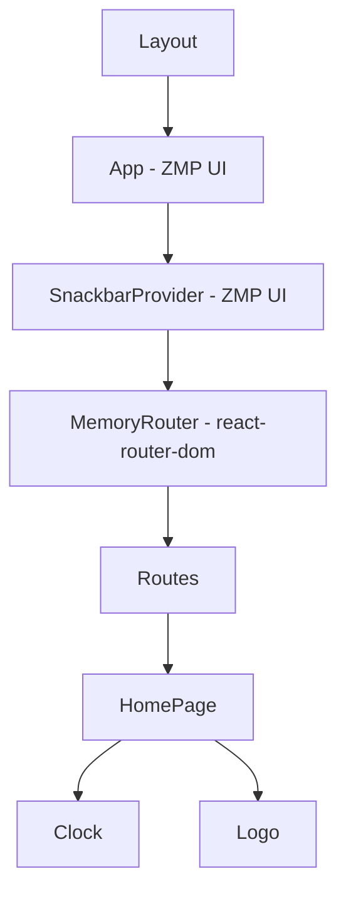

# React Component — pretty-little-shop-vn

## §1 Component Inventory

| Component | File | Type | Export | Props |
|-----------|------|------|--------|-------|
| Layout | `src/components/layout.tsx` | Shell | default | none |
| Clock | `src/components/clock.tsx` | Shared | default | none |
| Logo | `src/components/logo.tsx` | Shared | default | `SVGProps<SVGSVGElement>` |
| HomePage | `src/pages/index.tsx` | Page | default | none |

## §2 Component Hierarchy



## §3 Page Components

### HomePage (`src/pages/index.tsx`)
- Pattern: function declaration + default export
- ZMP UI: `Page`, `Box`, `Button`, `Icon`, `Text`
- ZMP SDK: `openMiniApp({ appId })` — opens ZaUI Components app
- Styling: Tailwind classes (`flex flex-col items-center justify-center space-y-6 bg-cover bg-center bg-no-repeat bg-white dark:bg-black`)
- Static asset: `bg.svg` imported as module
- Children: `<Clock />`, `<Logo />`

```tsx
// Pattern: Page component
function HomePage() {
  return (
    <Page className="...tailwind-classes" style={{ backgroundImage: `url(${bg})` }}>
      <Box></Box>
      <Box textAlign="center" className="space-y-1">
        <Text.Title size="xLarge">Hello world!</Text.Title>
        <Clock />
      </Box>
      <Button variant="primary" suffixIcon={<Icon icon="zi-more-grid" />}
        onClick={() => { openMiniApp({ appId: "..." }); }}>
        ZaUI Component Library
      </Button>
      <Logo className="fixed bottom-8" />
    </Page>
  );
}
export default HomePage;
```

## §4 Layout Component (`src/components/layout.tsx`)

- Pattern: arrow function + default export
- Purpose: App shell — wraps entire app with providers + routing
- Provider nesting: `App` → `SnackbarProvider` → `MemoryRouter` → `Routes`
- Theme: `getSystemInfo().zaloTheme as AppProps["theme"]` — auto-detect Zalo theme

```tsx
import { MemoryRouter, Routes, Route, Navigate } from 'react-router-dom';
import { ROUTES } from '@/constants/routes';

const Layout = () => {
  return (
    <App theme={getSystemInfo().zaloTheme as AppProps['theme']}>
      <SnackbarProvider>
        <MemoryRouter>
          <Routes>
            <Route path={ROUTES.HOME} element={<HomePage />} />
            <Route path="*" element={<Navigate to={ROUTES.HOME} replace />} />
          </Routes>
        </MemoryRouter>
      </SnackbarProvider>
    </App>
  );
};
export default Layout;
```

> ⚠️ MUST use MemoryRouter — Zalo WebView blocks History API

## §5 Shared Components

### Clock (`src/components/clock.tsx`)
- Pattern: function declaration + default export
- Hooks: `useState<string>` + `useEffect` with interval
- Cleanup: ✅ `return () => clearInterval(intervalId)`
- ZMP UI: `<Text className="font-mono">`
- Formatting: `toLocaleString("vi-VN")` — Vietnamese locale

```tsx
function Clock() {
  const [time, setTime] = useState("");
  useEffect(() => {
    const updateClock = () => { /* ... */ setTime(formattedTime); };
    updateClock();
    const intervalId = setInterval(updateClock, 1000);
    return () => clearInterval(intervalId);  // ✅ cleanup
  }, []);
  return <Text className="font-mono">{time}</Text>;
}
```

### Logo (`src/components/logo.tsx`)
- Pattern: function declaration + default export
- Props: `SVGProps<SVGSVGElement>` — fully typed, spread via `{...props}`
- Content: inline SVG (88x40px)
- Styling: `fill="currentcolor"` — inherits text color

```tsx
function Logo(props: SVGProps<SVGSVGElement>) {
  return (<svg width="88" height="40" {...props}>...</svg>);
}
```

> 🟡 48-line inline SVG — consider extracting to `.svg` file

## §6 ZMP UI Usage Map

| Component | Import From | Used In |
|-----------|-------------|---------|
| App | `zmp-ui` | layout.tsx |
| SnackbarProvider | `zmp-ui` | layout.tsx |
| AppProps | `zmp-ui/app` | layout.tsx |
| MemoryRouter | `react-router-dom` | layout.tsx |
| Routes | `react-router-dom` | layout.tsx |
| Route | `react-router-dom` | layout.tsx |
| Navigate | `react-router-dom` | layout.tsx |
| Page | `zmp-ui` | index.tsx |
| Box | `zmp-ui` | index.tsx |
| Button | `zmp-ui` | index.tsx |
| Icon | `zmp-ui` | index.tsx |
| Text | `zmp-ui` | index.tsx |

## §7 Component Templates

### Page Component Template
```tsx
import { Page, Box, Text } from "zmp-ui";

function FeaturePage() {
  return (
    <Page className="...tailwind-classes">
      <Box>
        <Text.Title>Title</Text.Title>
      </Box>
    </Page>
  );
}
export default FeaturePage;
```

### Reusable Component Template
```tsx
import { SVGProps, FC } from "react";

interface FeatureProps {
  title: string;
  className?: string;
}

const Feature: FC<FeatureProps> = ({ title, className }) => {
  return <div className={className}>{title}</div>;
};
export default Feature;
```

## §8 Conventions Observed
- ✅ ALL components = function components (no class except future ErrorBoundary)
- ✅ Page components use default export
- ✅ Props typed with TypeScript interfaces/generics
- ✅ Hooks at top-level only
- ✅ useEffect cleanup for timers
- ✅ Tailwind CSS for styling
- ✅ ZMP UI components for layout primitives

xref: react_architecture, react_shared_component, react_hook_helper
