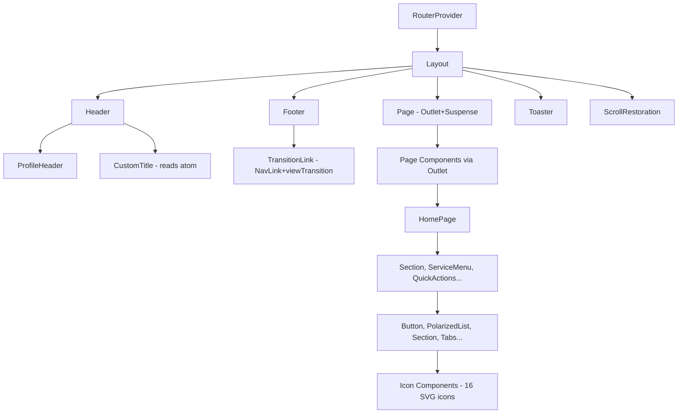

# React Components — pretty-little-shop-vn

## §1 Component Hierarchy



## §2 Layout Shell Components

### `src/components/layout.tsx`
```tsx
export default function Layout() {
  return (
    <div className="w-screen h-screen flex flex-col bg-background text-foreground overflow-hidden">
      <Header />
      <Page />
      <Footer />
      <Toaster containerClassName="toast-container" position="bottom-center" />
      <ScrollRestoration />
    </div>
  );
}
```
- No ZMP UI App/SnackbarProvider — uses Tailwind + react-hot-toast
- CSS vars: `bg-background`, `text-foreground` (from tailwind config)

### `src/components/header.tsx`
- Props: none — reads from `useRouteHandle()` + Jotai atoms
- Modes:
  1. Main header (`!handle.back`): gradient bg + shield icon + title/profile
  2. Sub-page header (`handle.back`): white bg + back button + title
  3. Profile header: user avatar + name from `userState` atom
- Custom title: `handle.title === "custom"` → reads `customTitleState` atom
- Navigation: `useNavigate(-1, { viewTransition: true })`
- App title from: `getConfig((c) => c.app.title)` (app-config.json)

### `src/components/footer.tsx`
- 5 nav items: Home `/`, Explore `/explore`, Booking `+` `/booking`, Schedule `/schedule`, Profile `/profile`
- Hidden when `handle.back === true`
- Uses `TransitionLink` (NavLink + viewTransition)
- Center item: BigPlusIcon with shadow/rounded treatment
- Wave decoration: `FooterWave` SVG component

### `src/components/page.tsx`
```tsx
function Page() {
  const [handle] = useRouteHandle();
  return (
    <div className={`flex-1 flex flex-col z-10 ${handle.noScroll ? "overflow-hidden" : "overflow-y-auto"}`}>
      <Suspense>
        <Outlet />
      </Suspense>
    </div>
  );
}
```

### `src/components/scroll-restoration.tsx`
- Manual scroll position map via `scrollPositions` object
- Saves/restores per `${pathname}${search}` key
- `handle.scrollRestoration` overrides saved value
- Cleanup: removes scroll listener on unmount

### `src/components/error-boundary.tsx`
```tsx
// React Router route ErrorBoundary
export function ErrorBoundary() {
  const error = useRouteError();
  const resetUser = useSetAtom(userState);
  useEffect(() => {
    if (error instanceof NotifiableError) {
      toast.error(error.message);
      resetUser();  // trigger userState refresh
    } else {
      console.warn({ error });
    }
  }, [error]);
  return <NotFound noToast />;
}
```
- Mounted as: `router route.ErrorBoundary = ErrorBoundary`
- NOT class-based — uses React Router v7 `useRouteError()` hook

## §3 Navigation Components

### `src/components/transition-link.tsx`
```tsx
// Wrapper for NavLink with View Transition API
export default function TransitionLink(props: NavLinkProps) {
  return <NavLink {...props} viewTransition />;
}
```
- Interface: `TransitionLinkProps extends NavLinkProps`
- All NavLink props supported (render prop `children({ isActive })`)

### `src/pages/404.tsx`
```tsx
export default function NotFound(props: { noToast?: boolean }) {
  const navigate = useNavigate();
  useEffect(() => {
    if (!props.noToast) toast.error("Trang không tồn tại");
    navigate(-1 as To, { viewTransition: true });
  }, []);
  return <></>;
}
```
- Auto-navigates back on mount
- `noToast` prop: suppress toast (used by ErrorBoundary)

## §4 Shared UI Components

### `src/components/button.tsx`
```tsx
interface ButtonProps extends ButtonHTMLAttributes<HTMLButtonElement> {
  children: ReactNode;
  loading?: boolean;
  onDisabledClick?: () => void;
}
```
- Full-width, gradient (primary → primary-gradient), rounded-full
- `loading`: shows spinner, hides content
- `disabled || loading`: overlay with `#E1E1E1CC`
- `onDisabledClick`: handles click when disabled (for validation feedback)

### `src/components/section.tsx`
```tsx
interface SectionProps {
  children: ReactNode;
  className?: string;
  title?: string;
  viewMore?: To;  // react-router-dom To type
  isCard?: boolean;
}
```
- `isCard`: wraps in white rounded card (`bg-white rounded-xl p-3.5`)
- `viewMore`: TransitionLink with ArrowRightIcon

### `src/components/tabs.tsx`
- Tab switcher component (interface TBD — not fully read)

### `src/components/polarized-list.tsx`
- List with left-right polarized layout

### `src/components/marked-title-section.tsx`
- Section with colored title marker

### `src/components/remote-diagnosis-item.tsx`
- Item for remote diagnosis listing

### `src/components/dashed-divider.tsx` / `horizontal-divider.tsx`
- Simple divider components

## §5 Icon Components (`src/components/icons/`)

| Icon | File | Props |
|------|------|-------|
| ArrowRight | arrow-right.tsx | SVG props |
| Back | back.tsx | SVG props |
| BigPlus | big-plus.tsx | `className`, `active?` |
| Call | call.tsx | SVG props |
| Cart | cart.tsx | `active?: boolean` |
| Check | check.tsx | SVG props |
| ChevronDown | chevron-down.tsx | SVG props |
| Explore | explore.tsx | `active?: boolean` |
| FooterWave | footer-wave.tsx | SVG + style props |
| HeaderShield | header-shield.tsx | `className` |
| Home | home.tsx | `active?: boolean` |
| PlusIcon | plus-icon.tsx | SVG props |
| Profile | profile.tsx | `active?: boolean` |
| Search | search.tsx | SVG props |
| Ship | ship.tsx | SVG props |
| Success | success.tsx | SVG props |

> Pattern: SVG inline components, `active?: boolean` for footer icon fill toggle

## §6 Item Components (`src/components/items/`)

| Component | File | Data Type |
|-----------|------|-----------|
| ArticleItem | items/article.tsx | `Article` |
| DepartmentItem | items/department.tsx | `Department` |
| DoctorItem | items/doctor.tsx | `Doctor` |
| ServiceItem | items/service.tsx | `Service` |

## §7 Form Components (`src/components/form/`)

| Component | File | Purpose |
|-----------|------|---------|
| DateTimePicker | date-time-picker.tsx | Date/time slot selection |
| DepartmentPicker | department-picker.tsx | Department selection |
| DoctorSelector | doctor-selector.tsx | Doctor selection |
| FabForm | fab-form.tsx | Floating action form |
| FormItem | item.tsx | Form field wrapper |
| SearchForm | search.tsx | Search input |
| SymptomInquiry | symptom-inquiry.tsx | Symptom input |
| TextareaWithImageUpload | textarea-with-image-upload.tsx | Text + image |

## §8 Page Components Summary

| Path | Component | Key Pattern |
|------|-----------|-------------|
| `/` | HomePage | Composite of sub-sections |
| `/search` | SearchResultPage | `loadable` atom for search |
| `/categories` | CategoriesPage | Sidebar + content (noScroll) |
| `/explore` | ExplorePage | — |
| `/services` | ServicesPage | Service list |
| `/service/:id` | ServiceDetailPage | useParams + detail atom |
| `/department/:id` | DepartmentDetailPage | useParams + detail atom |
| `/booking/:step?` | BookingPage | Multi-step form with steps |
| `/ask` | AskPage | SymptomDescription form |
| `/feedback` | FeedbackPage | Feedback form |
| `/schedule` | ScheduleHistoryPage | Booking list |
| `/schedule/:id` | ScheduleDetailPage | Booking detail |
| `/profile` | ProfilePage | User profile with userState |
| `/news/:id` | NewsPage | Article detail |
| `/invoices` | InvoicesPage | Invoice listing |
| `*` | NotFound | Auto-redirect |

## §9 ZMP UI Usage — REMOVED FROM ROUTING

> ⚠️ ZMP UI `App`, `ZMPRouter`, `AnimationRoutes`, `Route`, `SnackbarProvider` are **NOT used**.
> Routing handled entirely by `react-router-dom` v7 `createBrowserRouter`.
> Toast: `react-hot-toast` (NOT ZMP UI SnackbarProvider).

### Remaining ZMP UI usage (if any)
- `zmp-sdk`: `getUserInfo()` — Jotai `userState` atom
- `zmp-ui`: components NOT confirmed used — check individual page files

xref: react_architecture, react_state_service, react_hook_helper
