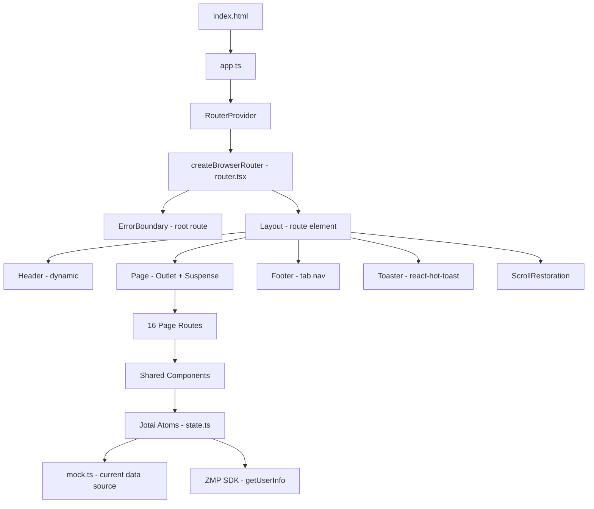

# System Overview — pretty-little-shop-vn

## §1 Tech Stack

| Category | Technology | Version | Config |
|----------|-----------|---------|--------|
| **Framework** | React | ^18.3.1 | package.json |
| **Language** | TypeScript | strict | tsconfig.json |
| **Build** | Vite | ^5.2.13 | vite.config.mts |
| **Platform** | Zalo Mini App (ZMP) | latest | zmp-cli.json |
| **Routing** | react-router-dom | **^7.6.1** | package.json |
| **State** | Jotai | ^2.12.1 | package.json |
| **Toast** | react-hot-toast | ^2.5.2 | package.json |
| **UI Library** | ZMP UI | ^1.11.7 | package.json (CSS only, routing REMOVED) |
| **Styling** | Tailwind CSS 3 | ^3.4.3 | tailwind.config.js |
| **CSS Pre** | SCSS (sass) | ^1.76.0 | package.json |
| **PostCSS** | autoprefixer | ^10.4.19 | postcss.config.js |
| **Plugin** | @vitejs/plugin-react | ^4.3.1 | vite.config.mts |
| **Plugin** | zmp-vite-plugin | latest | vite.config.mts |
| **Format** | prettier | 3.5.3 | package.json |

## §2 Architecture Pattern

**Single-Page Application (SPA)** — `createBrowserRouter` with dynamic basename for Zalo WebView.
> `basename = /zapps/${APP_ID}` in production; `""` in dev.



## §3 Entry Point Flow

```
index.html
  └─ <script src="/src/app.ts">
       ├─ import "zmp-ui/zaui.min.css"   ← ZMP UI CSS vars
       ├─ import "@/css/tailwind.scss"   ← Tailwind directives
       ├─ import "@/css/app.scss"        ← Custom styles
       ├─ import router from "@/router"  ← createBrowserRouter
       ├─ window.APP_CONFIG = appConfig  ← app-config.json
       └─ createRoot(#app).render(createElement(RouterProvider, { router }))
            └─ RouterProvider
                 └─ Layout (route element)
                      ├─ Header (dynamic: main / back / profile)
                      ├─ Page
                      │    └─ Suspense
                      │         └─ Outlet → Page Components
                      ├─ Footer (tab nav: Home/Explore/Booking/Schedule/Profile)
                      ├─ Toaster
                      └─ ScrollRestoration
```

## §4 Project Scale (Post-Expansion)

| Category | Count |
|----------|-------|
| Pages | 15 routes (+ 404) |
| Page sub-modules | ~30 sub-components |
| Shared components | 18 |
| Icon components | 16 |
| Item components | 4 |
| Form components | 8 |
| Custom hooks | 2 (`useRealHeight`, `useRouteHandle`) |
| Jotai atoms | ~22 (listings + detail + form + computed) |
| Util functions | ~12 (format + misc + errors) |
| Types | 12 interfaces |
| Mock data factories | 10 |
| Static assets | ~30 (doctors, services, explore, SVGs) |

## §5 Route Map

| Path | Component | Handle |
|------|-----------|--------|
| `/` | `HomePage` | — |
| `/search` | `SearchResultPage` | — |
| `/categories` | `CategoriesPage` | `back, title:"Danh mục", noScroll` |
| `/explore` | `ExplorePage` | — |
| `/services` | `ServicesPage` | `back, title:"Tất cả dịch vụ"` |
| `/service/:id` | `ServiceDetailPage` | `back, title:"custom"` |
| `/department/:id` | `DepartmentDetailPage` | `back, title:"custom"` |
| `/booking/:step?` | `BookingPage` | `back, title:"Đặt lịch khám"` |
| `/ask` | `AskPage` | `back, title:"Gửi câu hỏi"` |
| `/feedback` | `FeedbackPage` | `back, title:"Gửi phản ảnh"` |
| `/schedule` | `ScheduleHistoryPage` | — |
| `/schedule/:id` | `ScheduleDetailPage` | `back, title:"Chi tiết"` |
| `/profile` | `ProfilePage` | `profile:true` |
| `/news/:id` | `NewsPage` | `back, title:"Tin tức"` |
| `/invoices` | `InvoicesPage` | `back, title:"Hóa đơn"` |
| `*` | `NotFound` | — |

## §6 State Map

```
state.ts
├── Listings (atom<Promise<T[]>>)
│   ├── servicesState, doctorsState, availableTimeSlotsState
│   ├── articlesState, schedulesState, invoicesState
│   ├── departmentsState, departmentGroupsState
│   ├── symptomsState, feedbackCategoriesState
├── Detail (atomFamily → async derived)
│   ├── serviceByIdState(id), departmentByIdState(id)
│   ├── scheduleByIdState(id), newsByIdState(id)
├── Computed
│   ├── departmentHierarchyState (groups + departments joined)
│   └── searchResultState(keyword) — loadable, 1.5s delay
├── ZMP SDK
│   └── userState — atomWithRefresh → getUserInfo()
├── Forms (atomWithReset)
│   ├── symptomFormState, bookingFormState
│   ├── askFormState, feedbackFormState
└── Misc
    └── customTitleState — dynamic route title
```

## §7 HTML Meta

| Meta | Value |
|------|-------|
| CSP | `default-src * 'self' 'unsafe-inline' 'unsafe-eval' data: gap: content:` |
| viewport | `width=device-width, initial-scale=1, user-scalable=no, viewport-fit=cover` |
| theme-color | `#007aff` |

## §8 Dependency Graph

```mermaid
graph LR
    subgraph Runtime
        REACT[react ^18.3.1]
        REACT_DOM[react-dom ^18.3.1]
        REACT_ROUTER[react-router-dom ^7.6.1]
        REACT_HOT_TOAST[react-hot-toast ^2.5.2]
        JOTAI[jotai ^2.12.1]
        ZMP_SDK[zmp-sdk latest]
        ZMP_UI[zmp-ui ^1.11.7]
    end

    subgraph DevDeps
        VITE[vite ^5.2.13]
        PLUGIN_REACT[@vitejs/plugin-react ^4.3.1]
        ZMP_VITE[zmp-vite-plugin latest]
        TAILWIND[tailwindcss ^3.4.3]
        SASS[sass ^1.76.0]
        POSTCSS[postcss ^8.4.38]
        AUTOPREFIXER[autoprefixer ^10.4.19]
        PRETTIER[prettier 3.5.3]
    end

    REACT_ROUTER --> REACT
    REACT_HOT_TOAST --> REACT
    ZMP_UI --> REACT
    ZMP_SDK --> REACT
    JOTAI --> REACT
    PLUGIN_REACT --> VITE
    ZMP_VITE --> VITE
    TAILWIND --> POSTCSS
    AUTOPREFIXER --> POSTCSS
```

## §9 Scan-Verified Issues

| Issue | Severity | Location | Notes |
|-------|----------|----------|-------|
| `APP_CONFIG: any` type | 🟡 | global.d.ts | Type as `typeof appConfig` |
| No API service layer | 🟡 | state.ts | All data mocked — migration needed |
| No form validation | 🟠 | form pages | No client-side validation (react-hook-form not installed) |
| No loading states visible | 🟡 | pages | Suspense fallback is `null` (no spinner shown) |
| react-router-dom v7 | 🟠 | router.tsx | Uses `createBrowserRouter` NOT `MemoryRouter` — verify Zalo WebView compat |

xref: all knowledge files
