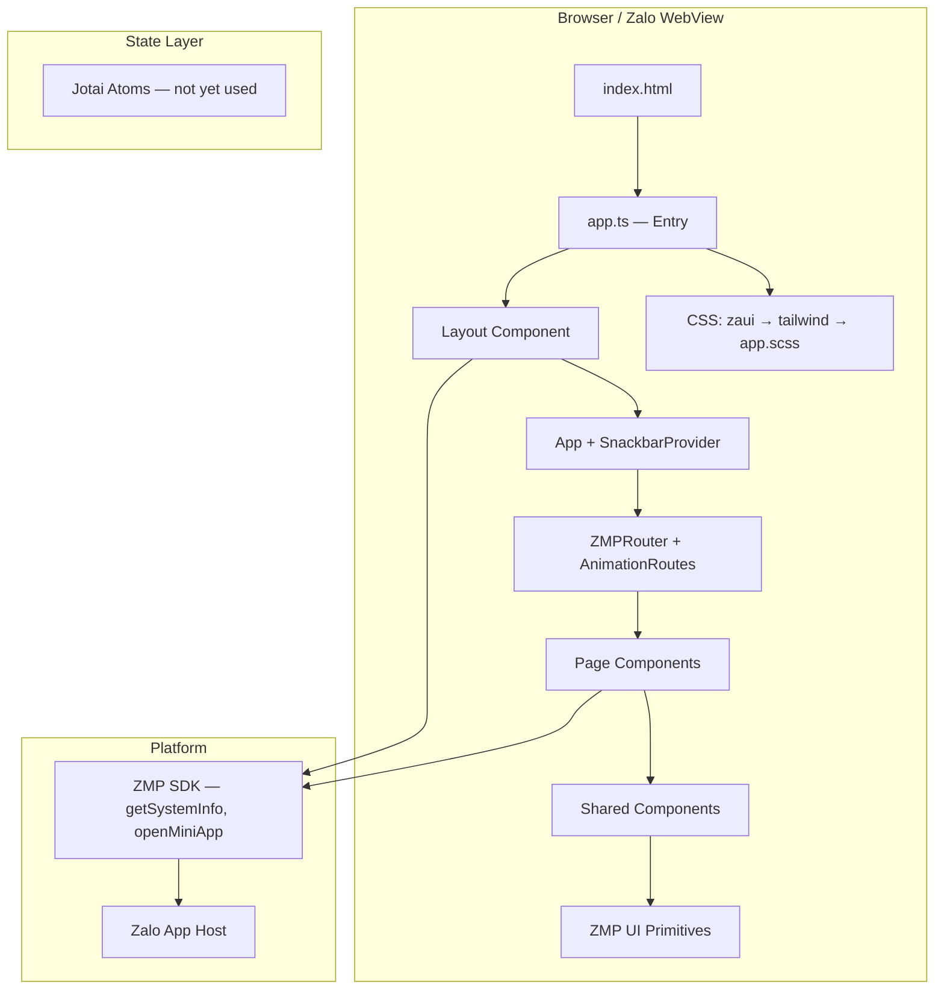

# System Overview — pretty-little-shop-vn

## §1 Tech Stack

| Layer | Technology | Version | Config |
|-------|-----------|---------|--------|
| **Framework** | React | ^18.3.1 | package.json |
| **Language** | TypeScript | strict | tsconfig.json |
| **Build** | Vite | ^5.2.13 | vite.config.mts |
| **Platform** | Zalo Mini App (ZMP) | latest | zmp-cli.json |
| **Routing** | react-router-dom | ^6.x | package.json |
| **UI Library** | ZMP UI | latest | package.json |
| **State** | Jotai | ^2.12.1 | package.json |
| **Styling** | Tailwind CSS 3 | ^3.4.3 | tailwind.config.js |
| **CSS Pre** | SCSS (sass) | ^1.76.0 | package.json |
| **PostCSS** | autoprefixer | ^10.4.19 | postcss.config.js |
| **Plugin** | @vitejs/plugin-react | ^4.3.1 | vite.config.mts |
| **Plugin** | zmp-vite-plugin | latest | vite.config.mts |

## §2 Architecture Pattern

**Single-Page Application (SPA)** — client-side routing via `react-router-dom` MemoryRouter (Zalo WebView — no HTML5 History API)
> `App + SnackbarProvider` (ZMP UI) wrap outside MemoryRouter as Zalo platform requirement



## §3 Project Structure

```
pretty-little-shop-vn/
├── index.html                  # HTML entry — CSP, viewport, #app div
├── src/
│   ├── app.ts                  # JS entry — CSS imports, createRoot, Layout mount
│   ├── components/
│   │   ├── layout.tsx          # App shell — ZMPRouter, providers, theme
│   │   ├── clock.tsx           # Real-time clock (useState + useEffect)
│   │   └── logo.tsx            # SVG logo (typed SVGProps)
│   ├── pages/
│   │   └── index.tsx           # HomePage — route "/"
│   ├── css/
│   │   ├── tailwind.scss       # @tailwind base/components/utilities
│   │   └── app.scss            # Custom app styles
│   └── static/
│       └── bg.svg              # Background asset
├── app-config.json             # ZMP app config (title, theme, statusBar)
├── zmp-cli.json                # ZMP CLI metadata (framework, template, theming)
├── package.json                # Dependencies + scripts (login, start, deploy)
├── tsconfig.json               # TypeScript config (strict, paths @/*)
├── vite.config.mts             # Vite config (plugins, alias, root)
├── tailwind.config.js          # Tailwind (darkMode, purge, fonts)
├── postcss.config.js           # PostCSS (tailwindcss + autoprefixer)
├── base_knowledge/             # Agent knowledge base
│   ├── common_rules/           # PRJ-06..PRJ-11 convention rules
│   ├── standards/              # Skill standards + catalog
│   └── structures/             # Generated knowledge files
│       ├── propose/            # 7 knowledge_*.md files
│       ├── apply/              # 1 knowledge_error_debug.md
│       └── features.md         # Features registry
├── openspec/                   # Feature pipeline configs
│   ├── config.yaml
│   └── config_modular_feature.yaml
└── .agent/                     # Agent skills, workflows, agents
    ├── skills/                 # 17 skills (learn-*, design-fe, etc.)
    ├── workflows/              # Pipelines, standalone, steps
    └── agents/                 # Specialist agents (react, fixbug, etc.)
```

## §4 Entry Flow

```
index.html
  └─ <script src="/src/app.ts">
       ├─ import "zmp-ui/zaui.css"       ← ZMP UI base
       ├─ import "@/css/tailwind.scss"   ← Tailwind directives
       ├─ import "@/css/app.scss"        ← Custom styles
       ├─ import Layout
       ├─ window.APP_CONFIG = appConfig
       └─ createRoot(#app).render(<Provider><Layout /></Provider>)
            └─ Provider (Jotai)
                 └─ Layout
                      └─ App[theme=zaloTheme]  (ZMP UI)
                           └─ SnackbarProvider  (ZMP UI)
                                └─ MemoryRouter  (react-router-dom)
                                     └─ Routes
                                          ├─ Route "/" → HomePage
                                          └─ Route "*" → Navigate "/"
                                               ├─ Clock
                                               └─ Logo
```

## §5 Route Map

| Path | Component | File | Status |
|------|-----------|------|--------|
| `/` | HomePage | `src/pages/index.tsx` | Active |

> Single-view template — more routes expected as features are added

## §6 Build & Deploy

| Command | Script | Tool | Purpose |
|---------|--------|------|---------|
| `npm run login` | `zmp login` | ZMP CLI | Authenticate Zalo account |
| `npm run start` | `zmp start` | Vite + ZMP | Dev server (localhost) |
| `npm run deploy` | `zmp deploy` | ZMP CLI | Deploy to Zalo platform |

### Vite Config
- Root: `./src`
- Plugins: `zaloMiniApp()` + `react()`
- Alias: `@` → `/src`
- Assets: `assetsInlineLimit: 0` (no inlining)

## §7 Platform Config

### `app-config.json`
| Key | Value |
|-----|-------|
| title | "Pretty Little Shop Vn" |
| textColor | light: "black", dark: "white" |
| statusBar | "transparent" |
| actionBarHidden | true |
| hideIOSSafeAreaBottom | true |

### `zmp-cli.json`
| Key | Value |
|-----|-------|
| framework | "react-typescript" |
| cssPreProcessor | "scss" |
| includeTailwind | true |
| package | "zmp-ui" |
| stateManagement | "jotai" |
| template | "single-view" |
| theming.color | "#007aff" |

### `index.html`
| Meta | Value |
|------|-------|
| CSP | `default-src * 'self' 'unsafe-inline' 'unsafe-eval' data: gap: content:` |
| viewport | width=device-width, initial-scale=1, user-scalable=no, viewport-fit=cover |
| theme-color | #007aff |

## §8 Dependency Graph

```mermaid
graph LR
    subgraph Runtime
        REACT[react ^18.3.1]
        REACT_DOM[react-dom ^18.3.1]
        REACT_ROUTER[react-router-dom ^6.x]
        JOTAI[jotai ^2.12.1]
        ZMP_SDK[zmp-sdk latest]
        ZMP_UI[zmp-ui latest]
    end

    subgraph DevDeps
        VITE[vite ^5.2.13]
        PLUGIN_REACT[@vitejs/plugin-react ^4.3.1]
        ZMP_VITE[zmp-vite-plugin latest]
        TAILWIND[tailwindcss ^3.4.3]
        SASS[sass ^1.76.0]
        POSTCSS[postcss ^8.4.38]
        AUTOPREFIXER[autoprefixer ^10.4.19]
        TS_REACT[@types/react ^18.3.1]
        TS_REACT_DOM[@types/react-dom ^18.3.0]
    end

    REACT_ROUTER --> REACT
    ZMP_UI --> REACT
    ZMP_SDK --> REACT
    JOTAI --> REACT
    PLUGIN_REACT --> VITE
    ZMP_VITE --> VITE
    TAILWIND --> POSTCSS
    AUTOPREFIXER --> POSTCSS
```

## §9 Scan-Verified Issues

| Issue | Severity | Location |
|-------|----------|----------|
| Missing ErrorBoundary | 🔴 | layout.tsx |
| Hardcoded appId | 🔴 | pages/index.tsx:26 |
| `as any` cast | 🟠 | app.ts:19 |
| getSystemInfo() no try/catch | 🟠 | layout.tsx:15 |
| Hardcoded #ffffff | 🟠 | css/app.scss:8 |
| Missing src/constants/ | 🟠 | project structure |

> Source: `/calibrate-knowledge --react --scan` (2026-04-15)
