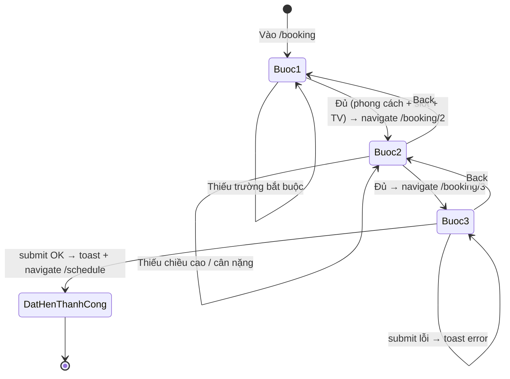

# SRS: Đặt Hẹn Thử Váy

> **Type**: MAINTENANCE
> **Date**: 2026-04-17
> **Source**: pre_process.md

---

## 1. Phạm vi tính năng

### Mô tả
Chuyển đổi module **Đặt Lịch Khám** (domain y tế) sang **Đặt Hẹn Thử Váy** (domain thời trang cưới) trong ứng dụng Zalo Mini App Pretty Little Shop Vn. Luồng vẫn giữ 3 bước nhưng nội dung, nhãn, và các trường dữ liệu được thay thế hoàn toàn phù hợp với việc khách hàng đặt lịch đến cửa hàng thử váy cưới.

### IN-SCOPE
- Nội dung và UI của 3 bước đặt hẹn: Step 1 (Chọn phong cách + Ngày giờ + Tư vấn viên), Step 2 (Số đo + Ghi chú + Ảnh tham khảo), Step 3 (Xác nhận + Gửi)
- Cập nhật `bookingFormState` và kiểu dữ liệu liên quan (DressStyle, Consultant, Measurements)
- Mock data mới cho danh sách phong cách váy và tư vấn viên

### OUT-OF-SCOPE
- Thay đổi routing, Layout, Header, Footer, bất kỳ shared component nào
- Backend API / xử lý đặt hẹn thực tế (mock only)
- Luồng xác nhận SMS / thông báo Zalo từ cửa hàng

---

## 2. Actors & Stakeholders

| Actor | Vai trò |
|-------|---------|
| **Khách hàng (KH)** | Người dùng Zalo, khởi tạo lịch hẹn thử váy cưới qua Mini App |
| **Tư vấn viên (TV)** | Nhân viên cửa hàng, được khách chọn để tư vấn trực tiếp |
| **Hệ thống (SYS)** | Zalo Mini App Pretty Little Shop Vn — xử lý form, validation, điều hướng |
| **Cửa hàng (SHOP)** | Pretty Little Shop — nhận lịch hẹn, xác nhận ngoài phạm vi ứng dụng |

---

## 3. Functional Requirements

### FR-001: Chọn phong cách váy
Hệ thống phải hiển thị danh sách phong cách váy cưới có sẵn khi khách hàng mở bước 1 đặt hẹn.
- Khách hàng được chọn đúng **một** phong cách váy
- Phong cách bao gồm: tên, hình ảnh minh họa (tùy chọn), mô tả ngắn
- Lựa chọn được lưu vào trạng thái form đặt hẹn

### FR-002: Chọn ngày và khung giờ hẹn
Hệ thống phải cho phép khách hàng chọn ngày và khung giờ trống để đến thử váy.
- Chỉ hiển thị ngày và giờ còn trống, không cho phép chọn thời điểm đã đặt
- Khung giờ đã hết: hệ thống thông báo "Khung giờ này đã hết, vui lòng chọn giờ khác"
- Lựa chọn ngày/giờ được lưu vào trạng thái form đặt hẹn

### FR-003: Chọn tư vấn viên
Hệ thống phải hiển thị danh sách tư vấn viên hiện có để khách hàng lựa chọn.
- Mỗi tư vấn viên có: tên, ảnh đại diện (tuỳ chọn), chuyên môn ngắn
- Khách hàng chọn đúng **một** tư vấn viên
- Lựa chọn được lưu vào trạng thái form đặt hẹn

### FR-004: Điều kiện hoàn thành Bước 1
Hệ thống phải chặn chuyển sang Bước 2 khi chưa điền đủ: phong cách váy + ngày/giờ + tư vấn viên.
- Nút "Tiếp theo" bị vô hiệu khi thiếu bất kỳ trường nào
- Khi nhấn vào nút vô hiệu: thông báo "Vui lòng điền đầy đủ thông tin!"

### FR-005: Nhập số đo cơ thể
Hệ thống phải cho phép khách hàng nhập thông số kích cỡ cơ thể ở Bước 2.
- Bắt buộc: chiều cao (cm), cân nặng (kg)
- Tùy chọn: số ngực (cm), số eo (cm), số hông (cm)
- Nút chuyển Bước 3 bị vô hiệu nếu thiếu chiều cao hoặc cân nặng

### FR-006: Nhập ghi chú và ảnh tham khảo
Hệ thống phải cho phép khách hàng ghi chú yêu cầu và tải ảnh tham khảo váy mong muốn ở Bước 2.
- Ghi chú: văn bản tự do, không bắt buộc
- Ảnh tham khảo: tải nhiều ảnh, không bắt buộc
- Dữ liệu được lưu vào trạng thái form đặt hẹn

### FR-007: Xem tóm tắt lịch hẹn
Hệ thống phải hiển thị tóm tắt toàn bộ thông tin đã nhập ở Bước 3 trước khi gửi.
- Hiển thị: phong cách váy, ngày/giờ hẹn, tên tư vấn viên, thông số cơ thể, ghi chú
- Ảnh tham khảo hiển thị dưới dạng thumbnail (nếu có)
- Khách hàng có thể quay lại sửa thông tin trước khi gửi

### FR-008: Gửi đặt hẹn
Hệ thống phải cho phép khách hàng gửi lịch hẹn thử váy sau khi xác nhận.
- Thành công: thông báo "Đặt hẹn thành công! Chúng tôi sẽ liên hệ xác nhận sớm." và điều hướng về `/schedule`
- Lỗi mạng: thông báo "Đã có lỗi xảy ra. Vui lòng thử lại."
- Sau khi gửi thành công: reset toàn bộ form đặt hẹn về trạng thái ban đầu

---

## 4. Use Case Flows

### 4.1 Basic Flow — Đặt hẹn thử váy thành công
1. KH mở tính năng "Đặt hẹn thử váy" từ trang chủ
2. SYS hiển thị Bước 1: danh sách phong cách váy + date picker + danh sách tư vấn viên
3. KH chọn phong cách váy, ngày/giờ, tư vấn viên
4. KH nhấn "Tiếp theo" — SYS điều hướng sang Bước 2
5. SYS hiển thị Bước 2: form nhập số đo + ghi chú + upload ảnh
6. KH nhập chiều cao, cân nặng (bắt buộc); tùy chọn: ngực, eo, hông, ghi chú, ảnh
7. KH nhấn "Tiếp theo" — SYS điều hướng sang Bước 3
8. SYS hiển thị Bước 3: tóm tắt toàn bộ thông tin lịch hẹn
9. KH xác nhận, nhấn "Đặt hẹn"
10. SYS gửi yêu cầu → thành công → toast + điều hướng `/schedule`

### 4.2 Alternative Flows
- **AF-01 Quay lại sửa**: KH nhấn Back ở Bước 2/3 → quay lại bước trước, form giữ dữ liệu đã nhập
- **AF-02 Khung giờ hết**: KH chọn giờ đã đầy → SYS thông báo → KH chọn giờ khác
- **AF-03 Chỉ nhập bắt buộc**: KH không nhập số ngực/eo/hông/ghi chú/ảnh → vẫn gửi được

### 4.3 Exception Flows
- **EF-01 Thiếu thông tin Bước 1**: Nút "Tiếp theo" bị disable → nhấn → toast cảnh báo
- **EF-02 Thiếu chiều cao/cân nặng**: Nút "Tiếp theo" Bước 2 bị disable
- **EF-03 Lỗi mạng khi gửi**: Toast lỗi → form giữ nguyên dữ liệu → KH thử lại

---

## 5. Business Rules

| # | Quy tắc |
|---|---------|
| BR-001 | Một lịch hẹn phải có đủ: phong cách váy, ngày/giờ, tư vấn viên, chiều cao, cân nặng |
| BR-002 | Khung giờ chỉ được chọn khi còn trống |
| BR-003 | Sau khi gửi đặt hẹn thành công, form phải được xóa về trạng thái ban đầu |
| BR-004 | Khách hàng chỉ có thể chọn một phong cách váy và một tư vấn viên mỗi lần đặt |
| BR-005 | Ảnh tham khảo không bắt buộc — lịch hẹn hợp lệ khi không có ảnh |

---

## 6. Data Requirements (Logical)

**Lịch hẹn thử váy** gồm:
- Phong cách váy được chọn (tên, mã định danh)
- Khung giờ hẹn (ngày, giờ bắt đầu)
- Tư vấn viên (tên, mã định danh)
- Số đo: chiều cao (cm) — bắt buộc; cân nặng (kg) — bắt buộc; số ngực, eo, hông (cm) — tùy chọn
- Ghi chú yêu cầu đặc biệt — tùy chọn
- Ảnh tham khảo — danh sách URL hoặc base64, tùy chọn

**Phong cách váy** gồm: mã định danh, tên phong cách, mô tả ngắn

**Tư vấn viên** gồm: mã định danh, họ tên, chuyên môn, ảnh đại diện (tùy chọn)

**Khung giờ** gồm: mã định danh, giờ bắt đầu, ngày, trạng thái (còn trống / đã đặt)

---

## 7. Non-functional Requirements

- Hệ thống phải phản hồi thao tác người dùng trong vòng 300ms (local state update).
- Chuyển đổi giữa các bước phải mượt mà, sử dụng view transition animation.
- Giao diện phải phù hợp màn hình Zalo Mini App (mobile-first, chiều rộng ≤ 430px).
- Màu sắc và phong cách thiết kế phải nhất quán với theme thời trang cưới (hồng / trắng / rose gold).

---

## 8. Authorization Requirements

- Tính năng đặt hẹn thử váy mở cho tất cả người dùng Zalo đã đăng nhập Mini App.
- Không yêu cầu phân quyền đặc biệt — [Enriched] tùy chọn trong tương lai: phân quyền theo trạng thái tài khoản.

---

## 9. Error Handling

| Tình huống | Thông báo hiển thị |
|------------|--------------------|
| Thiếu trường bắt buộc Bước 1 | "Vui lòng điền đầy đủ thông tin!" |
| Khung giờ đã hết | "Khung giờ này đã hết, vui lòng chọn giờ khác" |
| Thiếu chiều cao hoặc cân nặng | Nút "Tiếp theo" bị vô hiệu hóa |
| Lỗi mạng khi gửi đặt hẹn | "Đã có lỗi xảy ra. Vui lòng thử lại." |
| Gửi thành công | "Đặt hẹn thành công! Chúng tôi sẽ liên hệ xác nhận sớm." |

---

## 10. Constraints

| # | Ràng buộc |
|---|-----------|
| CON-001 | Không thay đổi cấu trúc routing `/booking/:step?` |
| CON-002 | Không thay đổi shared components (FabForm, Button, Section, v.v.) |
| CON-003 | Không thay đổi kiến trúc state Jotai — chỉ cập nhật nội dung atom |
| CON-004 | Toàn bộ dữ liệu danh sách (váy, tư vấn viên, khung giờ) là mock trong scope này |
| CON-005 | [Enriched] Form phải idempotent — submit lại sau lỗi không tạo lịch trùng |

---

## 11. Integrations

| Hệ thống | Mục đích |
|----------|----------|
| ZMP SDK | Lấy thông tin người dùng Zalo (userState) để pre-fill thông tin nếu cần |
| ZMP SDK (tùy chọn) | Upload ảnh tham khảo từ camera/thư viện ảnh Zalo |
| Mock API | Danh sách phong cách váy, tư vấn viên, khung giờ trống |

---

## 12. Assumptions

| # | Giả định |
|---|----------|
| AS-001 | Route `/booking/:step?` không thay đổi |
| AS-002 | `bookingFormState` được cập nhật với các field mới (dressStyle, consultant, measurements) |
| AS-003 | Danh sách tư vấn viên và phong cách váy sử dụng mock data thay thế |
| AS-004 | Khung giờ tái sử dụng `availableTimeSlotsState` hoặc mock tương đương |
| AS-005 | Upload ảnh tham khảo dùng ZMP SDK hoặc placeholder nếu chưa tích hợp |
| AS-006 | Mock data chỉ là placeholder — sẽ được thay bằng API thực trong giai đoạn sau |

---

## 13. Quality Score

| Tiêu chí | Điểm |
|----------|------|
| Rõ ràng | 23/25 |
| Đầy đủ | 22/25 |
| Nhất quán | 24/25 |
| Kiểm thử được | 22/25 |
| **Tổng** | **91/100** |

---

## 14. Open Questions

> Không có câu hỏi chưa giải quyết — tất cả đã được xử lý qua AS-001..006.

---

## 15. Inconsistencies & Issues

> Không phát hiện conflict hay ambiguity trong phạm vi đã định nghĩa.
